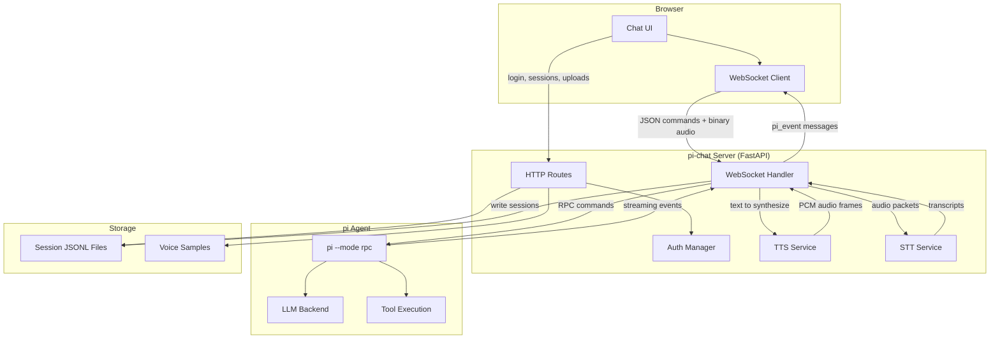
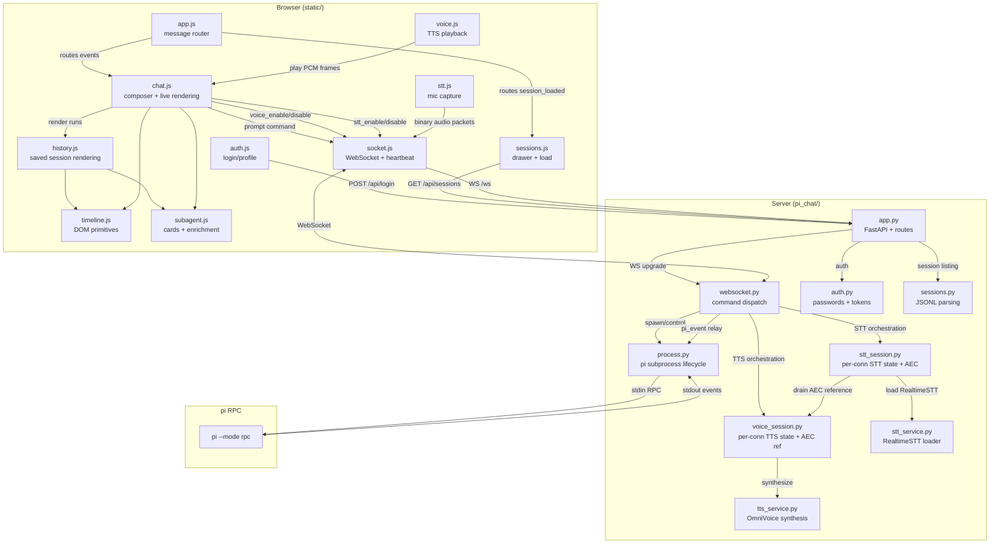
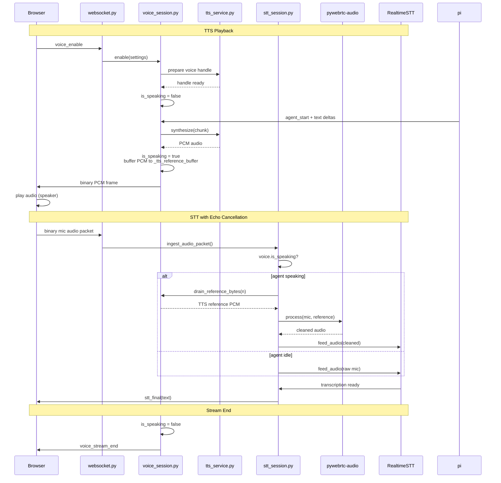

# pi chat

A small, local web interface for running the `pi` coding agent in RPC mode.
Streaming chat, image attachments, session history, Markdown rendering, and
sub-agent activity cards.

Intentionally designed for local, personal use.

**For LLMs working on this repo:** read `AGENTS.md` first. It is the single
source of truth for architecture, testing, RPC format, and development patterns.

## Requirements

- Python 3.12 or newer
- [`uv`](https://docs.astral.sh/uv/)
- A working `pi` executable on your `PATH`

Optional:

- Node.js 20.19+, 22.13+, or 24+ for the renderer-parity tests
- CUDA-capable GPU with ~6GB VRAM for production TTS (voice mode)

## Run locally

```bash
uv sync
uv run python server.py
```

Open [http://localhost:9000](http://localhost:9000). Select a profile, log in,
and start chatting. The `pi` subprocess starts on your first prompt.

## Authentication

Profile passwords are verified by FastAPI. After login, the browser receives an
HTTP-only session cookie; passwords and tokens are not exposed to JavaScript.
Sessions expire after seven days by default and are cleared on server restart.

For local use, the default profile passwords work out of the box. Before
exposing the app publicly, generate new salted scrypt hashes:

```bash
uv run python -m pi_chat.auth
```

Then set them in the server environment:

```bash
export PI_CHAT_B_PASSWORD_HASH='scrypt$...'
export PI_CHAT_R_PASSWORD_HASH='scrypt$...'
```

## Multiple users

Each WebSocket connection gets its own `pi` subprocess. Simultaneous users do
not share streaming state. Session history is separated by profile.

## Theme

Soft periwinkle and Lavender Blush. The theme toggle swaps their roles — one
becomes the page background, the other becomes panels and message surfaces.
Your choice is saved locally in the browser.

## Cloudflare Tunnel

When `cloudflared` runs on the same machine, listen only on loopback:

```bash
uv run python server.py
```

Point the tunnel at `http://127.0.0.1:9000` and use Cloudflare Access to
control who can reach the login page.

## Voice Mode (TTS)

Opt-in text-to-speech output for assistant responses using OmniVoice.
Voice mode begins synthesis while pi is still streaming, so speech starts
before the full response completes.

### Install voice dependencies

Voice is optional. Install only when needed:

```bash
uv sync --extra voice
```

### Configuration

| Environment variable | Default | Meaning |
|---|---|---|
| `PI_CHAT_TTS_MODEL` | `k2-fsa/OmniVoice` | HF model ID or local snapshot |
| `PI_CHAT_TTS_DEVICE` | `cuda:0` | Torch device |
| `PI_CHAT_TTS_DTYPE` | `float16` | Precision (`float16` or `float32`) |
| `PI_CHAT_TTS_NUM_STEPS` | `16` | Diffusion steps (fewer = faster) |
| `PI_CHAT_TTS_FLASHINFER` | `0` | Enable FlashInfer acceleration |
| `PI_CHAT_TTS_CUDA_GRAPH` | `0` | Enable CUDA graph |
| `PI_CHAT_TTS_CPU_THREADS` | `4` | Torch CPU threads for CPU mode |

### Custom Voices

Upload voice samples to create custom voices for TTS. Samples are normalized to
24 kHz mono WAV and stored in `~/.pi/voices/`.

| Endpoint | Purpose |
|---|---|
| `POST /api/voice/upload` | Upload a voice sample file |
| `GET /api/voice/list` | List available custom voices |
| `PUT /api/voice/{voice_id}` | Rename a custom voice |
| `DELETE /api/voice/{voice_id}` | Delete a custom voice |

### Development with fake PCM

Test the full voice stack without GPU or real model:

```bash
uv run python tools/run_fake_voice_server.py
```

### Validation

Real CPU validation (CUDA hidden, slow):

```bash
CUDA_VISIBLE_DEVICES="" uv run --extra voice python tools/run_voice_cpu_validation.py
```

Real GPU validation (run after unloading implementing LLM):

```bash
uv run --extra voice python tools/run_voice_gpu_validation.py
```

Benchmark:

```bash
uv run --extra voice python tools/benchmark_voice.py --iterations 10
```

## Development

### Parity tests

```bash
npm test
```

### Python tests

```bash
uv run pytest -q -m "not voice_cpu and not voice_gpu"
```

### RPC capture

```bash
uv run python tools/capture.py --scenario general
uv run python tools/capture.py --scenario subagent
uv run python tools/capture.py --prompt "custom prompt"
```

### Session viewer

```bash
PI_CHAT_DEV=1 uv run python server.py
# Visit: http://localhost:9000/?session=/path/to/session.jsonl
```

For full technical details (architecture, RPC events, testing, rendering
contract, voice protocol), see `AGENTS.md`.

## Architecture

### High-Level Overview



### Module-Level Data Flow



### Voice Mode (TTS + STT + AEC) Flow



## License

MIT
