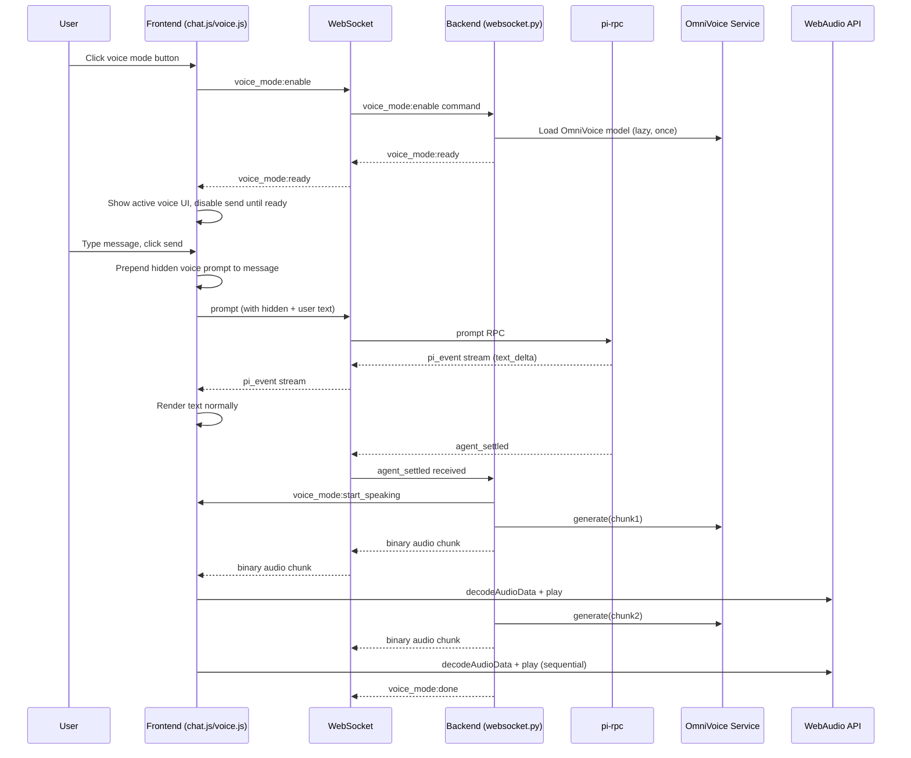
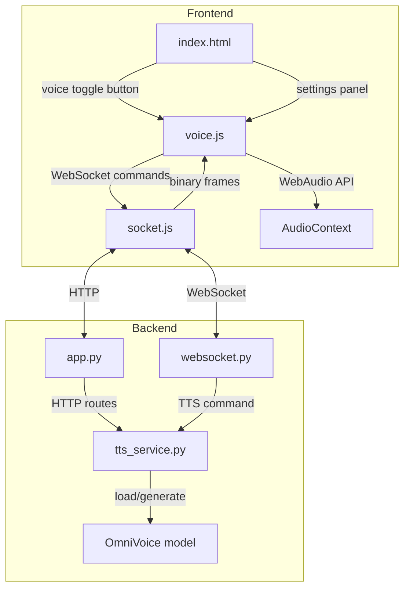

# Voice Mode Implementation Plan for pi-chat

## Overview

Add voice mode to pi-chat using OmniVoice TTS. When enabled, assistant responses are spoken aloud to the user via streamed audio chunks over WebSocket.

---

## Architecture

### High-Level Flow



### Component Diagram



---

## Files to Modify/Create

### New Files

| File | Purpose |
|------|---------|
| `pi_chat/tts_service.py` | OmniVoice model wrapper, lazy loading, chunk generation, voice design |
| `static/voice.js` | Voice mode state, WebSocket audio handling, WebAudio playback, settings panel |
| `static/voice.css` | Voice mode UI styles (toggle button, settings panel, loading indicator) |
| `tests/test_voice_chunking.py` | Unit tests for text chunking logic |

### Modified Files

| File | Changes |
|------|---------|
| `static/index.html` | Add voice toggle button, voice settings panel markup |
| `static/app.js` | Import voice.js, route voice_mode WebSocket messages |
| `static/chat.js` | Export state needed by voice.js; interrupt speech on new message; render user bubbles without hidden prompt |
| `static/socket.js` | Set `binaryType = 'arraybuffer'`, handle binary frames |
| `pi_chat/app.py` | Mount TTS service, add `/api/tts/status` endpoint |
| `pi_chat/websocket.py` | Handle `voice_mode:enable`, `voice_mode:disable`, `voice_mode:settings` commands; trigger TTS on `agent_settled` |
| `pi_chat/config.py` | Add `OMNIVOICE_MODEL_PATH` config option |
| `static/history.js` | Strip hidden voice prompts from loaded session user messages |

---

## Implementation Steps (Ordered)

### Phase 1: Backend Foundation

#### Step 1.1: Create TTS Service Module

**File:** `pi_chat/tts_service.py`

**Description:** Wrap OmniVoice model loading and generation. Support lazy loading so the model is only loaded when voice mode is first enabled. Once loaded, the model stays in hot VRAM to reduce latency — it is never unloaded.

**Key responsibilities:**
- Singleton pattern: one model instance per server process
- Lazy loading on first `enable()` call
- Once loaded, stays resident in VRAM (no unload)
- `generate_chunk(text, instruct)` method
- Thread-safe generation (OmniVoice is CPU/GPU bound, not async)
- Graceful error handling (model load failure, OOM, etc.)

**API:**
```python
class TTSService:
    def __init__(self, model_path: str = None):
        self.model = None
        self.loading = False
        self.loaded = False

    async def load(self) -> None:
        """Load OmniVoice model. Idempotent. Once loaded, stays in VRAM."""

    async def generate_chunk(self, text: str, instruct: str) -> bytes:
        """Generate audio for a single text chunk. Returns WAV bytes."""

    def is_ready(self) -> bool:
        """Check if model is loaded and ready."""
```

**Tests (TDD):**
- `test_is_ready_false_on_init`
- `test_load_sets_ready_true`
- `test_load_is_idempotent`
- `test_generate_chunk_returns_wav_bytes`
- `test_generate_chunk_with_voice_instruct`

---

#### Step 1.2: Add TTS Config

**File:** `pi_chat/config.py`

**Description:** Add configuration for OmniVoice model path.

```python
OMNIVOICE_MODEL_PATH = os.getenv(
    "OMNIVOICE_MODEL_PATH",
    str(PROJECT_ROOT / "experiments" / "OmniVoice"),
)
```

**Tests:**
- Verify default path resolves correctly

---

#### Step 1.3: Mount TTS Service in App

**File:** `pi_chat/app.py`

**Description:** Create TTSService instance in `create_app()` and store on `application.state`. Add status endpoint.

**Changes:**
```python
from .tts_service import TTSService
from .config import OMNIVOICE_MODEL_PATH

# In create_app():
application.state.tts = TTSService(model_path=OMNIVOICE_MODEL_PATH)

@app.get("/api/tts/status")
async def tts_status(request: Request):
    _require_account(request, auth)
    return {"ready": application.state.tts.is_ready()}
```

**Tests:**
- `test_tts_status_returns_not_ready_before_load`
- `test_tts_status_requires_auth`

---

### Phase 2: WebSocket Integration

#### Step 2.1: Add Voice Mode Commands

**File:** `pi_chat/websocket.py`

**Description:** Handle voice mode enable/disable/settings commands. Track voice mode state per WebSocket connection.

**New browser commands:**
```python
voice_mode:enable       # Enable voice mode, trigger model load
voice_mode:disable      # Disable voice mode
voice_mode:settings     # Update voice settings {gender, pitch, accent, age}
```

**New server messages:**
```python
voice_mode:ready        # Model loaded, voice mode active
voice_mode:error        # Failed to load model
voice_mode:start_speaking  # TTS generation starting
voice_mode:done         # TTS generation complete
```

**Changes:**
- Add `voice_mode_enabled` and `voice_settings` to WebSocket handler state
- On `voice_mode:enable`, call `tts.load()` and send `voice_mode:ready` or `voice_mode:error`
- On `agent_settled`, if voice mode enabled, trigger TTS generation in background task
- Send binary audio chunks via `websocket.send_bytes()`

**TTS trigger logic:**
- Listen for `agent_settled` pi_event
- Extract the last assistant message text from the event
- Chunk text using chunking logic (Phase 3)
- For each chunk: generate audio, send binary frame
- Send `voice_mode:done` when complete

**Tests (TDD):**
- `test_voice_mode_enable_triggers_load`
- `test_voice_mode_disable_clears_state`
- `test_voice_mode_settings_updates_instruct`
- `test_agent_settled_triggers_tts_when_enabled`
- `test_agent_settled_no_tts_when_disabled`

---

#### Step 2.2: Modify Prompt Handling for Voice Mode

**File:** `pi_chat/websocket.py`

**Description:** The frontend will send the full message (hidden prompt + user text). No backend changes needed here — the frontend prepends the hidden prompt before sending.

**Note:** This is simpler than backend injection because:
1. The hidden prompt is invisible in the UI (frontend never renders it)
2. pi-rpc sees the full message including hidden prompt
3. Session files store the full message (for debugging)

---

### Phase 3: Text Chunking Logic

#### Step 3.1: Implement Chunking Strategy

**File:** `pi_chat/tts_service.py` (or separate `pi_chat/tts_chunking.py`)

**Description:** Split assistant responses into chunks for streaming TTS.

**Chunking Rules:**
1. Split on sentence boundaries: `.`, `!`, `?` followed by space or end
2. Split on emdashes: `—` or `--` (treat as natural pause points)
3. Split on OmniVoice emotion tags: `[laughter]`, `[sigh]`, etc. (these are natural breakpoints)
4. Maximum chunk length: 150 characters (prevents awkwardly long TTS chunks)
5. Minimum chunk length: 10 characters (prevents tiny fragments)
6. Preserve emotion tags within chunks (they modify the preceding word)
7. Skip code blocks, URLs, and inline code (don't speak them)

**Regex patterns:**
```python
# Emotion tags
EMOTION_TAGS = r'\[(laughter|sigh|confirmation-en|question-en|question-ah|question-oh|question-ei|question-yi|surprise-ah|surprise-oh|surprise-wa|surprise-yo|dissatisfaction-hnn)\]'

# Code blocks (skip entirely)
CODE_BLOCK = r'```[\s\S]*?```'

# Inline code (skip)
INLINE_CODE = r'`[^`]+`'

# URLs (skip)
URLS = r'https?://\S+'

# Sentence boundary (split here)
SENTENCE_BOUNDARY = r'(?<=[.!?])\s+(?=[A-Z])'

# Em-dash boundary (split here)
EMDASH_BOUNDARY = r'\s+[—–-]{2,}\s+'
```

**Algorithm:**
1. Strip markdown code blocks (don't speak code)
2. Strip inline code and URLs (don't speak technical artifacts)
3. Split on emotion tag boundaries (each tag starts a new context)
4. Split on sentence boundaries
5. Split on em-dashes
6. Enforce max/min length constraints
7. Filter out empty/whitespace-only chunks

**Tests (TDD):**
- `test_split_on_period`
- `test_split_on_emdash`
- `test_split_on_emotion_tags`
- `test_max_chunk_length`
- `test_min_chunk_length`
- `test_skip_code_blocks`
- `test_skip_inline_code`
- `test_skip_urls`
- `test_preserve_emotion_tags_in_chunks`
- `test_empty_input_returns_empty_list`
- `test_single_sentence_no_split`

---

### Phase 4: Frontend — Voice Mode UI

#### Step 4.1: Add Voice Toggle Button

**File:** `static/index.html`

**Description:** Add voice mode toggle button to the left of the input area.

**Markup:**
```html
<div class="input-area">
  <div class="input-row">
    <!-- Voice toggle button (left of textarea) -->
    <button class="input-btn voice-toggle-btn" id="voice-toggle-btn" type="button" aria-label="Enable voice mode" title="Voice mode">
      <svg width="20" height="20" viewBox="0 0 24 24" fill="none" stroke="currentColor" stroke-width="2">
        <path d="M12 1a3 3 0 0 0-3 3v8a3 3 0 0 0 6 0V4a3 3 0 0 0-3-3z"/>
        <path d="M19 10v2a7 7 0 0 1-14 0v-2"/>
        <line x1="12" y1="19" x2="12" y2="23"/>
        <line x1="8" y1="23" x2="16" y2="23"/>
      </svg>
    </button>

    <div class="input-wrapper">
      <textarea id="user-input" placeholder="Message pi..." rows="1"></textarea>
      <div class="input-actions">
        <button class="input-btn" id="attach-btn" type="button" aria-label="Attach file">
          <!-- existing attach icon -->
        </button>
        <!-- Voice settings button (appears when voice mode is active) -->
        <button class="input-btn voice-settings-btn" id="voice-settings-btn" type="button" aria-label="Voice settings" title="Voice settings" style="display:none;">
          <svg width="18" height="18" viewBox="0 0 24 24" fill="none" stroke="currentColor" stroke-width="2">
            <circle cx="12" cy="12" r="3"/>
            <path d="M19.4 15a1.65 1.65 0 0 0 .33 1.82l.06.06a2 2 0 0 1-2.83 2.83l-.06-.06a1.65 1.65 0 0 0-1.82-.33 1.65 1.65 0 0 0-1 1.51V21a2 2 0 0 1-4 0v-.09A1.65 1.65 0 0 0 9 19.4a1.65 1.65 0 0 0-1.82.33l-.06.06a2 2 0 0 1-2.83-2.83l.06-.06A1.65 1.65 0 0 0 4.68 15a1.65 1.65 0 0 0-1.51-1H3a2 2 0 0 1 0-4h.09A1.65 1.65 0 0 0 4.6 9a1.65 1.65 0 0 0-.33-1.82l-.06-.06a2 2 0 0 1 2.83-2.83l.06.06A1.65 1.65 0 0 0 9 4.68a1.65 1.65 0 0 0 1-1.51V3a2 2 0 0 1 4 0v.09a1.65 1.65 0 0 0 1 1.51 1.65 1.65 0 0 0 1.82-.33l.06-.06a2 2 0 0 1 2.83 2.83l-.06.06A1.65 1.65 0 0 0 19.4 9a1.65 1.65 0 0 0 1.51 1H21a2 2 0 0 1 0 4h-.09a1.65 1.65 0 0 0-1.51 1z"/>
          </svg>
        </button>
      </div>
    </div>
    <button class="send-btn" id="send-btn" type="button" aria-label="Send message" disabled>
      <!-- existing send icon -->
    </button>
  </div>
</div>

<!-- Voice Settings Panel -->
<div class="voice-settings-panel" id="voice-settings-panel">
  <div class="voice-settings-header">
    <h3>Voice Settings</h3>
    <button class="voice-settings-close" id="voice-settings-close" type="button" aria-label="Close voice settings">&times;</button>
  </div>
  <div class="voice-settings-body">
    <label>Gender
      <select id="voice-gender">
        <option value="female">Female</option>
        <option value="male">Male</option>
      </select>
    </label>
    <label>Pitch
      <select id="voice-pitch">
        <option value="low">Low</option>
        <option value="moderate" selected>Moderate</option>
        <option value="high">High</option>
      </select>
    </label>
    <label>Accent
      <select id="voice-accent">
        <option value="american accent" selected>American</option>
        <option value="british accent">British</option>
        <option value="australian accent">Australian</option>
      </select>
    </label>
    <label>Age
      <select id="voice-age">
        <option value="young">Young</option>
        <option value="middle-aged" selected>Middle-aged</option>
        <option value="elderly">Elderly</option>
      </select>
    </label>
  </div>
</div>
```

**Tests:**
- Manual: Verify buttons render in correct positions
- Manual: Verify settings panel is hidden by default

---

#### Step 4.2: Create voice.js Module

**File:** `static/voice.js`

**Description:** Manage voice mode state, WebSocket communication, audio playback, and settings.

**Key exports:**
```javascript
export function setupVoice(options) {
  // options: { sendCommand, onVoiceReady, onVoiceError }
}

export function isVoiceModeEnabled() {
  return voiceEnabled;
}

export function getVoicePrompt() {
  // Returns the hidden voice mode prompt text
}

export function stripVoicePrompt(text) {
  // Strip the hidden voice prompt from user messages (for session rendering)
  const pattern = /<AUTOMATED MESSAGE>.*?<\/AUTOMATED MESSAGE>\s*\n\n/gs;
  return text.replace(pattern, '').trim();
}

export function stopSpeaking() {
  // Interrupt current speech (called when new message is sent)
  if (audioContext) {
    audioContext.close();
    audioContext = null;
  }
  isSpeaking = false;
}
```

**State:**
```javascript
let voiceEnabled = false;
let voiceLoading = false;
let voiceReady = false;
let audioContext = null;
let isSpeaking = false;
let voiceSettings = {
  gender: 'female',
  pitch: 'moderate',
  accent: 'american accent',
  age: 'middle-aged',
};
```

**Hidden voice prompt:**
```javascript
const VOICE_PROMPT = `<AUTOMATED MESSAGE> The user has enabled voice mode, so all of your messages will be converted and played to the user via TTS. To increase immersion please utilize the following tags when appropriate to showcase your emotion: [laughter], [sigh], [confirmation-en], [question-en], [question-ah], [question-oh], [question-ei], [question-yi], [surprise-ah], [surprise-oh], [surprise-wa], [surprise-yo], [dissatisfaction-hnn]. Please ignore this portion of the message </AUTOMATED MESSAGE>`;
```

**WebSocket handlers:**
- `voice_mode:ready` → Set `voiceReady = true`, update UI, enable send button
- `voice_mode:error` → Show error, disable voice mode UI
- `voice_mode:start_speaking` → Set `isSpeaking = true`, show speaking indicator
- `voice_mode:done` → Set `isSpeaking = false`, hide speaking indicator
- Binary frames → Queue audio chunk, play via WebAudio

**WebAudio playback:**
```javascript
async function playAudioChunk(arrayBuffer) {
  if (!audioContext) {
    audioContext = new (window.AudioContext || window.webkitAudioContext)();
  }
  const audioBuffer = await audioContext.decodeAudioData(arrayBuffer);
  const source = audioContext.createBufferSource();
  source.buffer = audioBuffer;
  source.connect(audioContext.destination);
  source.start();
}
```

**Settings panel:**
- Toggle visibility on settings button click
- Update `voiceSettings` on any select change
- Send `voice_mode:settings` command to backend

**Tests (TDD):**
- `test_voice_prompt_contains_tags`
- `test_voice_prompt_wrapped_in_tags`
- Manual: Toggle voice mode, verify loading → ready → error states
- Manual: Change settings, verify command sent

---

#### Step 4.3: Add Voice CSS

**File:** `static/voice.css`

**Description:** Styles for voice toggle button, loading indicator, settings panel.

**Key styles:**
- Voice toggle button: Same size/style as attach button
- Loading spinner on voice toggle when model is loading
- Active state: Green/blue accent when voice mode is enabled
- Settings panel: Slide-in panel or dropdown near the settings button
- Speaking indicator: Small pulsing icon or animated waveform

**Tests:**
- Manual: Verify styles match existing UI aesthetic

---

#### Step 4.4: Integrate voice.js into app.js

**File:** `static/app.js`

**Changes:**
```javascript
import { setupVoice } from './voice.js';

setupVoice({
  sendCommand,
  onVoiceReady: () => { /* update send button, show settings */ },
  onVoiceError: () => { /* show error in chat */ },
});
```

**Route voice_mode messages:**
```javascript
function routeServerMessage(message) {
  // Existing routes...
  if (message.type === 'voice_mode:ready') {
    handleVoiceReady();
  } else if (message.type === 'voice_mode:error') {
    handleVoiceError(message.message);
  } else if (message.type === 'voice_mode:start_speaking') {
    handleVoiceStartSpeaking();
  } else if (message.type === 'voice_mode:done') {
    handleVoiceDone();
  }
}
```

**Tests:**
- Manual: Verify message routing works end-to-end

---

#### Step 4.5: Modify chat.js for Voice Mode

**File:** `static/chat.js`

**Changes:**

1. **Prepend hidden prompt to messages when voice mode is enabled:**
```javascript
function submitPrompt() {
  const text = userInput.value.trim();
  if (!text && pendingFiles.length === 0) return;

  // Interrupt any ongoing speech when user sends a new message
  if (isSpeaking) {
    stopSpeaking();
  }

  let messageText = text;
  if (isVoiceModeEnabled()) {
    messageText = getVoicePrompt() + '\n\n' + text;
  }

  // Render user bubble with only the visible text (not the hidden prompt)
  appendUserMessage(text); // Only the user's actual text

  // ... rest of prompt handling (send messageText with hidden prompt)
}
```

2. **Disable send button while voice model is loading:**
```javascript
function updateSendButton() {
  const hasContent = userInput.value.trim().length > 0 || pendingFiles.length > 0;
  const voiceLoading = isVoiceLoading(); // New check
  sendButton.disabled = isAgentRunning || !hasContent || voiceLoading;
}
```

3. **Export state for voice.js:**
```javascript
export function isAgentRunning() {
  return isAgentRunning;
}
```

**Tests:**
- `test_voice_prompt_prepended_when_enabled`
- `test_voice_prompt_not_prepended_when_disabled`
- `test_user_bubble_shows_only_visible_text`
- `test_speaking_interrupted_on_new_message`
- Manual: Verify send button disabled during loading

---

#### Step 4.6: Configure WebSocket for Binary Frames

**File:** `static/socket.js`

**Changes:**
```javascript
function createSocket(options) {
  let socket;

  function connect() {
    socket = new WebSocket(url);
    socket.binaryType = 'arraybuffer'; // Enable binary frames

    socket.onmessage = async (event) => {
      if (event.data instanceof ArrayBuffer) {
        // Binary audio chunk
        options.onAudioChunk?.(event.data);
        return;
      }
      // JSON message
      const message = JSON.parse(event.data);
      options.onMessage?.(message);
    };
  }
}
```

**Tests:**
- Manual: Verify binary frames are received and routed to voice.js

---

### Phase 5: Backend TTS Generation on agent_settled

#### Step 5.1: Trigger TTS on agent_settled

**File:** `pi_chat/websocket.py`

**Description:** When `agent_settled` is received and voice mode is enabled, extract the last assistant message text, chunk it, and stream audio.

**Logic:**
```python
# In handle_websocket, when pi_event is agent_settled:
if event.get("type") == "agent_settled" and voice_mode_enabled:
    # Extract last assistant message from the most recent agent_end
    assistant_text = extract_last_assistant_text(pi, event)
    if assistant_text:
        asyncio.create_task(
            stream_tts_response(
                websocket,
                application.state.tts,
                assistant_text,
                voice_settings,
            )
        )
```

**stream_tts_response:**
```python
async def stream_tts_response(websocket, tts_service, text, settings):
    try:
        await websocket.send_json({"type": "voice_mode:start_speaking"})

        # Build voice instruct from settings
        instruct = build_voice_instruct(settings)

        # Chunk text
        chunks = chunk_text_for_tts(text)

        # Generate and stream each chunk
        for chunk in chunks:
            audio_bytes = await tts_service.generate_chunk(chunk, instruct)
            await websocket.send_bytes(audio_bytes)

        await websocket.send_json({"type": "voice_mode:done"})
    except Exception as error:
        log.error("TTS streaming error: %s", error)
        await websocket.send_json({"type": "voice_mode:error", "message": str(error)})
```

**build_voice_instruct:**
```python
def build_voice_instruct(settings):
    parts = [settings["gender"], settings["pitch"], settings["accent"]]
    if settings["age"] != "middle-aged":
        parts.append(settings["age"])
    return ", ".join(parts)
```

**Tests (TDD):**
- `test_build_voice_instruct_default`
- `test_build_voice_instruct_with_age`
- `test_stream_tts_sends_start_speaking`
- `test_stream_tts_sends_chunks`
- `test_stream_tts_sends_done`
- `test_stream_tts_handles_error`

---

## Data Flow

### Voice Mode State

**Frontend:**
- `voiceEnabled`: User has clicked the toggle
- `voiceLoading`: Model is loading on backend
- `voiceReady`: Backend confirmed model is loaded
- `isSpeaking`: Currently streaming audio

**Backend:**
- Per-WebSocket: `voice_mode_enabled`, `voice_settings`
- Server-wide: `TTSService` singleton with model state

### Settings Flow

```
User changes dropdown → voice.js updates voiceSettings → send voice_mode:settings →
websocket.py updates per-connection voice_settings → next TTS uses new instruct
```

### Hidden Prompt Injection

```
User types "Hello" → chat.js checks isVoiceModeEnabled() →
prepends VOICE_PROMPT → sends "VOICE_PROMPT\n\nHello" →
pi-rpc receives full message → session stores full message →
UI only renders "Hello" (the visible part)
```

**Key insight:** The UI never shows the hidden prompt because:
1. The frontend creates the user message bubble with only the visible text
2. The WebSocket sends the full message (hidden + visible) to pi-rpc
3. pi-rpc stores the full message in session files
4. On reload, the session loads with the full message, but we can strip the hidden prompt when rendering (future enhancement)

---

## TDD Test Plan

### Backend Tests

**tts_service.py:**
```bash
uv run pytest tests/test_tts_service.py -v
```
- `test_is_ready_false_on_init`
- `test_load_sets_ready_true`
- `test_load_is_idempotent`
- `test_generate_chunk_returns_bytes`
- `test_generate_chunk_with_instruct`
- `test_generate_chunk_raises_on_not_loaded`
- `test_unload_frees_model`

**tts_chunking.py:**
```bash
uv run pytest tests/test_voice_chunking.py -v
```
- `test_split_on_period`
- `test_split_on_exclamation`
- `test_split_on_question`
- `test_split_on_emdash`
- `test_split_on_emotion_tags`
- `test_max_chunk_length_enforced`
- `test_min_chunk_length_enforced`
- `test_code_blocks_removed`
- `test_inline_code_removed`
- `test_urls_removed`
- `test_empty_input`
- `test_single_short_sentence`
- `test_long_paragraph`
- `test_preserves_emotion_tags`

**websocket.py voice mode:**
```bash
uv run pytest tests/test_websocket_voice.py -v
```
- `test_voice_mode_enable_command`
- `test_voice_mode_disable_command`
- `test_voice_mode_settings_command`
- `test_voice_mode_ready_message`
- `test_voice_mode_error_message`
- `test_agent_settled_triggers_tts`
- `test_agent_settled_no_tts_when_disabled`

### Frontend Tests

**voice.js:**
```bash
node --check static/voice.js
```
- Manual tests via browser:
  - Toggle voice mode on/off
  - Verify loading state
  - Verify ready state
  - Verify settings panel opens/closes
  - Verify settings changes send commands

**Integration:**
```bash
npm test
```
- Existing parity tests should still pass (voice mode is additive)

### Manual Verification

1. **Voice mode enable flow:**
   - Click voice toggle → spinner appears → green when ready
   - Send button disabled during loading
   - Settings button appears when ready

2. **Voice mode message flow:**
   - Send message with voice mode on
   - Text renders normally
   - After agent_settled, audio plays
   - Speaking indicator visible during playback

3. **Settings flow:**
   - Open settings panel
   - Change gender/pitch/accent/age
   - Send new message
   - Verify different voice characteristics

4. **Voice mode disable flow:**
   - Click voice toggle → disabled state
   - Settings button hidden
   - New messages not spoken

---

## Decisions

1. **Audio format for WebSocket:** WAV chunks with headers (larger but simpler decode).

2. **Voice mode persistence:** Voice mode does NOT persist across page reloads. However, once the OmniVoice model is loaded into VRAM, it stays resident to reduce latency on the next voice mode activation.

3. **Audio interrupt behavior:** When the user sends a new message while speech is playing, immediately interrupt and stop current speech, then start speaking the new response.

4. **Hidden prompt stripping:** Always strip hidden voice prompts from displayed user messages. Since we use a consistent template wrapped in `<AUTOMATED MESSAGE>` tags, detection is straightforward. Add stripping logic in both `chat.js` (live) and `history.js` (loaded sessions).

5. **Error handling:** Log errors to server stdout. No fancy fallback needed — if TTS fails, it will be evident when audio cuts out or doesn't start.

6. **Mobile considerations:** Autoplay policies may block WebAudio on mobile until user gesture. Voice mode enable (user click) should satisfy this, but worth testing.

---

## Estimated Complexity

| Phase | Complexity | Risk |
|-------|-----------|------|
| 1: Backend Foundation | Medium | Model loading, VRAM management |
| 2: WebSocket Integration | Medium | Binary frames, async TTS triggering |
| 3: Text Chunking | Low | Pure logic, well-testable |
| 4: Frontend UI | Medium | State management, WebAudio integration |
| 5: TTS on agent_settled | Medium | Text extraction, streaming coordination |

**Total estimated effort:** 2-3 focused implementation sessions

---

## Next Steps

1. Implement Phase 1 (backend foundation) and verify model loads
2. Implement Phase 3 (chunking) with full test coverage
3. Implement Phase 2 (WebSocket commands)
4. Implement Phase 4 (frontend UI)
5. Implement Phase 5 (TTS on agent_settled)
6. End-to-end testing and polish

---

## Subagent Execution Plan

This implementation is well-suited for the orchestrate-subagent-stack pattern. The work decomposes into 5 dependent phases plus verification, each with clear acceptance criteria and file boundaries.

### Orchestration Topology

```
Main (you + me)
├── Worker 1: Backend Foundation (Phase 1)
├── Worker 2: Text Chunking (Phase 3) — independent of W1
├── Worker 3: WebSocket Integration (Phase 2) — depends on W1, W2
├── Worker 4: Frontend UI (Phase 4)
├── Worker 5: TTS on agent_settled (Phase 5) — depends on W3, W4
└── Worker 6: Integration Verifier — depends on all
```

**Rationale:** Phases 1 and 3 have no dependencies on each other and can run sequentially without blocking. Phases 2-5 build on prior work. A final read-only verifier validates the full stack.

### Worker Contracts

#### Worker 1: Backend Foundation

```typescript
subagent({
  name: "voice-backend-foundation",
  taskId: "voice-mode-backend-foundation",
  task: "Implement Phase 1 of voice mode: TTSService module, config, and status endpoint. The OmniVoice model should load lazily on first enable() and stay resident in VRAM (no unload).",
  scope: [
    "pi_chat/tts_service.py",
    "pi_chat/config.py",
    "pi_chat/app.py",
    "tests/test_tts_service.py"
  ],
  nonGoals: [
    "Do not implement WebSocket commands yet (Phase 2).",
    "Do not implement text chunking yet (Phase 3).",
    "Do not modify frontend files."
  ],
  acceptance: [
    "TTSService class exists with load(), generate_chunk(), is_ready().",
    "load() is idempotent and thread-safe.",
    "Model stays loaded after voice mode is disabled (no unload method).",
    "OMNIVOICE_MODEL_PATH config added to config.py.",
    "/api/tts/status endpoint returns {ready: bool} and requires auth.",
    "TTSService mounted on application.state in create_app()."
  ],
  verification: [
    "uv run python -c 'from pi_chat.tts_service import TTSService; print(TTSService)'",
    "uv run python -m compileall -q pi_chat/",
    "uv run pytest tests/test_tts_service.py -v"
  ],
  timeout: 2400,
  maxTurns: 200
})
```

#### Worker 2: Text Chunking

```typescript
subagent({
  name: "voice-text-chunking",
  taskId: "voice-mode-text-chunking",
  task: "Implement Phase 3 of voice mode: text chunking logic for splitting assistant responses into TTS-friendly segments. Follow the chunking rules in VOICE_MODE_IMPLEMENTATION_PLAN.md.",
  scope: [
    "pi_chat/tts_chunking.py",
    "tests/test_voice_chunking.py"
  ],
  nonGoals: [
    "Do not implement TTSService or WebSocket commands.",
    "Do not modify frontend files."
  ],
  acceptance: [
    "chunk_text_for_tts(text) function exists and returns list of string chunks.",
    "Splits on sentence boundaries (.!?), emdashes (— --), and emotion tags.",
    "Enforces max chunk length (150 chars) and min chunk length (10 chars).",
    "Removes code blocks, inline code, and URLs before chunking.",
    "Preserves emotion tags within their chunks.",
    "Returns empty list for empty/whitespace-only input."
  ],
  verification: [
    "uv run python -m compileall -q pi_chat/",
    "uv run pytest tests/test_voice_chunking.py -v"
  ],
  timeout: 2400,
  maxTurns: 200
})
```

#### Worker 3: WebSocket Integration (Dependent on W1, W2)

```typescript
subagent({
  name: "voice-websocket-integration",
  taskId: "voice-mode-websocket-integration",
  task: "Implement Phase 2 of voice mode: WebSocket commands for voice mode enable/disable/settings. Begin by verifying TTSService and tts_chunking modules exist from prior workers.",
  scope: [
    "pi_chat/websocket.py",
    "pi_chat/tts_service.py",
    "pi_chat/tts_chunking.py",
    "tests/test_websocket_voice.py"
  ],
  nonGoals: [
    "Do not implement TTS generation on agent_settled yet (Phase 5).",
    "Do not modify frontend files."
  ],
  acceptance: [
    "Begin by confirming TTSService and chunk_text_for_tts are importable.",
    "voice_mode:enable command triggers TTSService.load() and sends voice_mode:ready or voice_mode:error.",
    "voice_mode:disable command clears per-connection voice mode state.",
    "voice_mode:settings command updates per-connection voice_settings.",
    "build_voice_instruct(settings) constructs instruct string from gender/pitch/accent/age.",
    "Per-connection state tracks voice_mode_enabled and voice_settings."
  ],
  verification: [
    "uv run python -m compileall -q pi_chat/",
    "uv run pytest tests/test_websocket_voice.py -v"
  ],
  timeout: 2400,
  maxTurns: 200
})
```

#### Worker 4: Frontend UI

```typescript
subagent({
  name: "voice-frontend-ui",
  taskId: "voice-mode-frontend-ui",
  task: "Implement Phase 4 of voice mode: voice toggle button, settings panel, voice.js module, voice.css, WebSocket binary frame handling, and hidden prompt injection. Follow VOICE_MODE_IMPLEMENTATION_PLAN.md for markup and logic.",
  scope: [
    "static/index.html",
    "static/voice.js",
    "static/voice.css",
    "static/app.js",
    "static/chat.js",
    "static/socket.js",
    "static/history.js"
  ],
  nonGoals: [
    "Do not implement backend TTS generation on agent_settled (Phase 5).",
    "Do not modify backend Python files."
  ],
  acceptance: [
    "Voice toggle button added left of input area.",
    "Voice settings panel with gender/pitch/accent/age dropdowns.",
    "voice.js exports: setupVoice(), isVoiceModeEnabled(), getVoicePrompt(), stripVoicePrompt(), stopSpeaking().",
    "Hidden voice prompt prepended to messages when voice mode enabled.",
    "User message bubbles render only visible text (no hidden prompt).",
    "stripVoicePrompt() used in history.js for loaded sessions.",
    "WebSocket configured for binaryType='arraybuffer'.",
    "send button disabled while voice model is loading.",
    "stopSpeaking() called when new message sent during playback."
  ],
  verification: [
    "node --check static/voice.js",
    "node --check static/app.js",
    "node --check static/chat.js",
    "node --check static/socket.js",
    "npm test"
  ],
  timeout: 2400,
  maxTurns: 200
})
```

#### Worker 5: TTS on agent_settled (Dependent on W3, W4)

```typescript
subagent({
  name: "voice-tts-generation",
  taskId: "voice-mode-tts-generation",
  task: "Implement Phase 5 of voice mode: trigger TTS generation on agent_settled when voice mode is enabled. Extract last assistant message, chunk it, and stream WAV audio chunks via WebSocket. Begin by verifying WebSocket voice commands exist from Worker 3.",
  scope: [
    "pi_chat/websocket.py",
    "pi_chat/tts_service.py",
    "pi_chat/tts_chunking.py"
  ],
  nonGoals: [
    "Do not modify frontend files.",
    "Do not change TTSService or chunking logic unless verified broken."
  ],
  acceptance: [
    "Begin by confirming voice_mode commands are handled in websocket.py.",
    "On agent_settled with voice_mode_enabled, extract last assistant message text.",
    "stream_tts_response() chunks text and generates audio per chunk.",
    "Sends voice_mode:start_speaking before first chunk.",
    "Sends binary WAV chunks via websocket.send_bytes().",
    "Sends voice_mode:done after all chunks.",
    "Logs errors to stdout on failure."
  ],
  verification: [
    "uv run python -m compileall -q pi_chat/",
    "uv run pytest tests/test_websocket_voice.py -v -k 'agent_settled'"
  ],
  timeout: 2400,
  maxTurns: 200
})
```

#### Worker 6: Integration Verifier (Read-Only)

```typescript
subagent({
  name: "voice-integration-verifier",
  taskId: "voice-mode-integration-verify",
  task: "Independently verify the completed voice mode implementation against all acceptance criteria. Report failures with exact reproduction evidence; do not repair them.",
  scope: [
    "pi_chat/",
    "static/",
    "tests/",
    "VOICE_MODE_IMPLEMENTATION_PLAN.md",
    "git diff"
  ],
  nonGoals: ["Do not edit files or weaken tests."],
  acceptance: [
    "Inspect combined diff for scope violations (no unexpected files changed).",
    "All Python files compile without errors.",
    "All JS files pass node --check.",
    "Existing npm test parity tests still pass.",
    "New unit tests pass for tts_service, chunking, websocket voice commands.",
    "TTSService has no unload() method (stays in VRAM).",
    "stripVoicePrompt() exists and is used in chat.js and history.js.",
    "Voice toggle button and settings panel markup exist in index.html.",
    "WebSocket handles voice_mode:enable/disable/settings commands.",
    "agent_settled triggers TTS when voice_mode_enabled."
  ],
  verification: [
    "uv run python -m compileall -q pi_chat/",
    "for file in static/*.js; do [ \"$(basename \"$file\")\" != \"marked.min.js\" ] && node --check \"$file\"; done",
    "npm test",
    "uv run pytest tests/test_tts_service.py tests/test_voice_chunking.py tests/test_websocket_voice.py -v"
  ],
  timeout: 2400,
  maxTurns: 200
})
```

### Execution Order

1. **Worker 1** (Backend Foundation) — 2400s, 200 turns
2. **Worker 2** (Text Chunking) — 2400s, 200 turns
3. **Worker 3** (WebSocket Integration) — 2400s, 200 turns — validates W1+W2
4. **Worker 4** (Frontend UI) — 2400s, 200 turns
5. **Worker 5** (TTS on agent_settled) — 2400s, 200 turns — validates W3
6. **Worker 6** (Integration Verifier) — 2400s, 200 turns — read-only

**Total estimated time:** 24 hours of worker execution (generous budget) (serial).

### Recovery Strategy

If a worker fails:
1. Classify the failure from its receipt (implementation, test environment, missing prerequisite, timeout).
2. Inspect persisted files — the worker may have made partial changes.
3. Launch a targeted recovery worker with the exact failing command and evidence.
4. After recovery that crosses worker boundaries, run Worker 6 again.

### Notes

- Each worker inherits the full session context including VOICE_MODE_IMPLEMENTATION_PLAN.md.
- Workers 3 and 5 validate their prerequisites before editing (dependent worker pattern).
- Worker 6 is read-only to ensure independent verification.
- All workers use the same verification commands defined in the TDD test plan.
