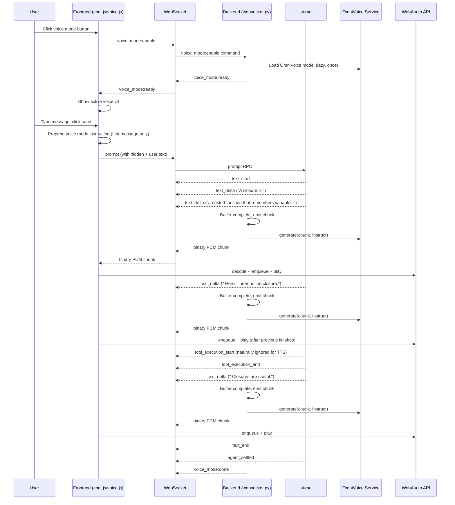
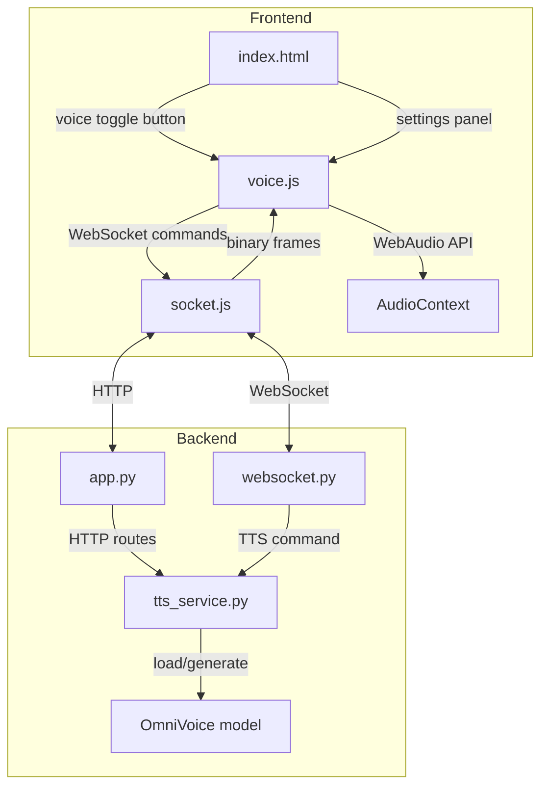

# Voice Mode Implementation Plan for pi-chat

## Overview

Add voice mode to pi-chat using OmniVoice TTS. When enabled, assistant responses are spoken aloud to the user via streamed audio chunks over WebSocket. Audio generation begins as soon as the first complete sentence is streamed from the LLM, not after the full response completes.

**Key design decision:** Chunk incoming `text_delta` events in real-time and trigger TTS per-chunk as soon as natural sentence boundaries are detected. This provides near-real-time audio feedback instead of waiting for the full LLM response.

---

## OmniVoice Model Reference

OmniVoice is a diffusion-based zero-shot TTS model supporting 600+ languages with voice cloning and voice design capabilities.

**Source:** `experiments/OmniVoice/` (local clone of k2-fsa/OmniVoice)

### Key Characteristics

- **Architecture:** Diffusion language model (Qwen3 LLM backbone + Higgs-Audio v2 tokenizer)
- **RTF:** ~0.025 (40x faster than real-time) — 22 seconds of speech generates in <2 seconds on RTX 4090
- **VRAM:** ~5-6 GB in FP16
- **Sampling rate:** 24 kHz
- **Output:** Returns list of numpy arrays (float32, range [-1, 1])

### Voice Design Mode (Used in pi-chat)

No reference audio needed. Voice controlled via `instruct` parameter with comma-separated attributes:

```python
audio = model.generate(
    text="Hello, this is a test.",
    instruct="female, moderate pitch, american accent",
)
```

**Supported attributes (from `docs/voice-design.md`):**

| Category | Options |
|----------|---------|
| Gender | `male`, `female` |
| Age | `child`, `teenager`, `young adult`, `middle-aged`, `elderly` |
| Pitch | `very low pitch`, `low pitch`, `moderate pitch`, `high pitch`, `very high pitch` |
| Style | `whisper` |
| English Accent | `american accent`, `british accent`, `australian accent`, `canadian accent`, `indian accent`, `chinese accent`, `korean accent`, `japanese accent`, `portuguese accent`, `russian accent` |

**Reference docs:**
- `experiments/OmniVoice/README.md` — Full API reference
- `experiments/OmniVoice/docs/voice-design.md` — Voice design attributes
- `experiments/OmniVoice/docs/generation-parameters.md` — Generation parameters
- `experiments/OmniVoice/docs/tips.md` — Usage tips

### Minimal Python API

```python
from omnivoice import OmniVoice
import torch
import numpy as np

model = OmniVoice.from_pretrained(
    "k2-fsa/OmniVoice",
    device_map="cuda:0",
    dtype=torch.float16
)

# Voice design (no reference audio needed)
audio = model.generate(
    text="Hello, this is a test.",
    instruct="female, moderate pitch, american accent",
)

# audio[0] is numpy array (T,) of float32 samples at 24 kHz
# Convert to int16 PCM bytes for WebSocket:
pcm_bytes = (audio[0] * 32767).astype(np.int16).tobytes()
```

### Non-Verbal Emotion Tags

OmniVoice supports inline emotion tags that modify speech delivery:

```python
audio = model.generate(
    text="[laughter] You really got me. I didn't see that coming at all.",
)
```

**Supported tags:** `[laughter]`, `[sigh]`, `[confirmation-en]`, `[question-en]`, `[question-ah]`, `[question-oh]`, `[question-ei]`, `[question-yi]`, `[surprise-ah]`, `[surprise-oh]`, `[surprise-wa]`, `[surprise-yo]`, `[dissatisfaction-hnn]`

These tags should be preserved in TTS chunks and the voice mode prompt should instruct pi to use them.

---

## Architecture

### High-Level Flow



### Component Diagram



### Streaming Chunking Design

The core innovation: process `text_delta` events in real-time, accumulating text into a buffer and emitting complete chunks at natural boundaries.

**Flow:**
1. On `text_start`: Clear buffer, begin accumulating
2. On each `text_delta`: Append delta to buffer
3. Run chunking logic on buffer:
   - If a complete chunk can be extracted (sentence boundary, emotion tag, em-dash), emit it immediately for TTS
   - Keep remaining text in buffer
4. On `text_end`: Emit any remaining buffer content as final chunk
5. Tool execution events are naturally ignored (we only process `text_delta`)

**Example:**
```
Buffer accumulates: "A closure is a nested function that remembers variables."
→ Complete sentence detected → Emit chunk → TTS generates audio

Buffer accumulates: " Here, `inner` is the closure."
→ Complete sentence detected → Emit chunk → TTS generates audio

tool_execution_start, tool_execution_end → Ignored

Buffer accumulates: " Closures are useful for factory functions."
→ Complete sentence detected → Emit chunk → TTS generates audio
```

---

## Files to Modify/Create

### New Files

| File | Purpose |
|------|---------|
| `pi_chat/tts_service.py` | OmniVoice model wrapper, lazy loading, chunk generation, voice design |
| `pi_chat/tts_chunking.py` | Text preprocessing and chunking for TTS consumption |
| `static/voice.js` | Voice mode state, WebSocket audio handling, WebAudio playback, settings panel |
| `static/voice.css` | Voice mode UI styles (toggle button, settings panel, loading indicator) |
| `tests/test_voice_chunking.py` | Unit tests for text chunking logic |

### Modified Files

| File | Changes |
|------|---------|
| `static/index.html` | Add voice toggle button, voice settings panel markup |
| `static/app.js` | Import voice.js, route voice_mode WebSocket messages |
| `static/chat.js` | Export state needed by voice.js; prepend voice instruction on first message; interrupt speech on new message |
| `static/socket.js` | Set `binaryType = 'arraybuffer'`, handle binary frames |
| `pi_chat/app.py` | Mount TTS service, add `/api/tts/status` endpoint |
| `pi_chat/websocket.py` | Handle `voice_mode:enable`, `voice_mode:disable`, `voice_mode:settings` commands; process `text_delta` events for streaming TTS |
| `pi_chat/config.py` | Add `OMNIVOICE_MODEL_PATH` config option |

---

## Implementation Steps (Ordered)

### Phase 1: Backend Foundation

#### Step 1.1: Create TTS Service Module

**File:** `pi_chat/tts_service.py`

**Description:** Wrap OmniVoice model loading and generation. Support lazy loading so the model is only loaded when voice mode is first enabled. Once loaded, the model stays in VRAM to reduce latency — it is never unloaded.

**Key responsibilities:**
- Singleton pattern: one model instance per server process
- Lazy loading on first `enable()` call
- Once loaded, stays resident in VRAM (no unload)
- `generate_chunk(text, instruct)` method returning PCM bytes
- Thread-safe generation (OmniVoice is CPU/GPU bound, run in executor)
- Graceful error handling (model load failure, OOM, etc.)

**API:**
```python
import asyncio
import logging
from typing import Optional

import numpy as np
import torch
from omnivoice import OmniVoice

log = logging.getLogger("pi-chat")


class TTSService:
    def __init__(self, model_path: str):
        self.model_path = model_path
        self.model: Optional[OmniVoice] = None
        self.loading = False
        self.loaded = False
        self._lock = asyncio.Lock()

    async def load(self) -> None:
        """Load OmniVoice model. Idempotent. Once loaded, stays in VRAM."""
        if self.loaded:
            return
        async with self._lock:
            if self.loaded:
                return
            self.loading = True
            try:
                log.info("Loading OmniVoice model from %s ...", self.model_path)
                self.model = await asyncio.to_thread(
                    OmniVoice.from_pretrained,
                    self.model_path,
                    device_map="cuda:0",
                    dtype=torch.float16,
                )
                self.loaded = True
                log.info("OmniVoice model loaded successfully")
            except RuntimeError as e:
                if "out of memory" in str(e).lower():
                    log.error("OmniVoice model load failed: GPU out of memory")
                    raise RuntimeError("TTS model failed to load: GPU out of memory. Ensure at least 6GB VRAM is available.") from e
                log.error("OmniVoice model load failed: %s", e)
                raise
            finally:
                self.loading = False

    async def generate_chunk(self, text: str, instruct: str) -> bytes:
        """Generate audio for a single text chunk. Returns raw PCM bytes (int16, 24kHz, mono)."""
        if not self.loaded or self.model is None:
            raise RuntimeError("TTS model not loaded")

        audio = await asyncio.to_thread(
            self.model.generate,
            text=text,
            instruct=instruct,
        )

        # audio[0] is numpy array (T,) of float32 in range [-1, 1]
        # Convert to int16 PCM bytes for WebSocket transmission
        pcm_bytes = (audio[0] * 32767).astype(np.int16).tobytes()
        return pcm_bytes

    def is_ready(self) -> bool:
        """Check if model is loaded and ready."""
        return self.loaded

    def is_loading(self) -> bool:
        """Check if model is currently loading."""
        return self.loading
```

**Tests (TDD):**
- `test_is_ready_false_on_init`
- `test_load_sets_ready_true`
- `test_load_is_idempotent`
- `test_generate_chunk_returns_bytes`
- `test_generate_chunk_with_voice_instruct`
- `test_generate_chunk_raises_on_not_loaded`
- `test_load_handles_oom_gracefully`

---

#### Step 1.2: Add TTS Config

**File:** `pi_chat/config.py`

**Description:** Add configuration for OmniVoice model path.

```python
OMNIVOICE_MODEL_PATH = os.getenv(
    "OMNIVOICE_MODEL_PATH",
    str(PROJECT_ROOT / "experiments" / "OmniVoice"),
)
```

**Tests:**
- Verify default path resolves correctly

---

#### Step 1.3: Mount TTS Service in App

**File:** `pi_chat/app.py`

**Description:** Create TTSService instance in `create_app()` and store on `application.state`. Add status endpoint.

**Changes:**
```python
from .tts_service import TTSService
from .config import OMNIVOICE_MODEL_PATH

# In create_app():
application.state.tts = TTSService(model_path=OMNIVOICE_MODEL_PATH)

@app.get("/api/tts/status")
async def tts_status(request: Request):
    _require_account(request, auth)
    tts = application.state.tts
    return {
        "ready": tts.is_ready(),
        "loading": tts.is_loading(),
    }
```

**Tests:**
- `test_tts_status_returns_not_ready_before_load`
- `test_tts_status_requires_auth`

---

### Phase 2: Text Chunking Logic

#### Step 2.1: Implement Chunking Strategy

**File:** `pi_chat/tts_chunking.py`

**Description:** Split assistant text into chunks for streaming TTS. Based on `data-samples/text_chunking.py` prototype.

**Chunking Rules:**
1. Split on sentence boundaries: `.`, `!`, `?` followed by space and uppercase letter
2. Split on em-dashes: `—` or `--` (treat as natural pause points)
3. Split on OmniVoice emotion tags: `[laughter]`, `[sigh]`, etc. (these are natural breakpoints, keep tag with chunk)
4. Maximum chunk length: 200 characters (prevents awkwardly long TTS chunks)
5. Minimum chunk length: 15 characters (prevents tiny fragments)
6. Preserve emotion tags within chunks (they modify the preceding word)
7. Skip code blocks entirely (never speak them)
8. Speak inline code normally (usually short)
9. Skip URL text (replace with nothing or "[link]")

**Regex patterns:**
```python
EMOTION_TAGS = r'\[(?:laughter|sigh|confirmation-en|question-en|question-ah|question-oh|question-ei|question-yi|surprise-ah|surprise-oh|surprise-wa|surprise-yo|dissatisfaction-hnn)\]'
CODE_BLOCK = r'```[\s\S]*?```'
INLINE_CODE = r'`[^`]+`'
URLS = r'https?://\S+'
SENTENCE_BOUNDARY = r'(?<=[.!?])\s+(?=[A-Z])'
EMDASH_BOUNDARY = r'\s+[—–-]{2,}\s+'
```

**Core functions:**

```python
import re
from typing import List, Tuple

EMOTION_TAGS = r'\[(?:laughter|sigh|confirmation-en|question-en|question-ah|question-oh|question-ei|question-yi|surprise-ah|surprise-oh|surprise-wa|surprise-yo|dissatisfaction-hnn)\]'
CODE_BLOCK = r'```[\s\S]*?```'
INLINE_CODE = r'`[^`]+`'
URLS = r'https?://\S+'
SENTENCE_BOUNDARY = r'(?<=[.!?])\s+(?=[A-Z])'
EMDASH_BOUNDARY = r'\s+[—–-]{2,}\s+'

BREAK_PATTERN = re.compile(f'({EMOTION_TAGS})|({SENTENCE_BOUNDARY})|({EMDASH_BOUNDARY})')

MAX_CHUNK_LEN = 200
MIN_CHUNK_LEN = 15


def preprocess_text(text: str) -> str:
    """Clean text for TTS: remove code blocks, handle URLs."""
    # Remove code blocks entirely
    text = re.sub(CODE_BLOCK, '', text)
    # Remove URLs (keep surrounding text)
    text = re.sub(URLS, '', text)
    return text


def _is_open(text: str) -> bool:
    """True if buffer currently ends mid-fence / mid-inline-code / mid-url."""
    if len(re.findall(r'```', text)) % 2 == 1:
        return True

    text_wo_blocks = re.sub(CODE_BLOCK, '', text)
    if text_wo_blocks.count('`') % 2 == 1:
        return True

    urls = list(re.finditer(URLS, text_wo_blocks))
    if urls and urls[-1].end() == len(text_wo_blocks):
        return True

    return False


def chunk_buffer(buffer: str) -> Tuple[List[str], str]:
    """
    Repeatedly strips completed code blocks and slices off completed chunks.
    Returns (chunks_to_emit, remaining_buffer).

    Designed for streaming: called repeatedly as text_delta events arrive.
    Preserves state across open constructs (code blocks, inline code, URLs).
    """
    chunks = []
    buffer = preprocess_text(buffer)

    while True:
        if _is_open(buffer):
            break  # still mid-construct, wait for more tokens

        # Drop any completed code block entirely -- never emitted
        code_spans = [m.span() for m in re.finditer(CODE_BLOCK, buffer)]
        if code_spans:
            start, end = code_spans[0]
            buffer = buffer[:start] + buffer[end:]
            continue

        # Inline code / urls are kept in the text, just not split inside
        no_split_spans = (
            [m.span() for m in re.finditer(INLINE_CODE, buffer)]
            + [m.span() for m in re.finditer(URLS, buffer)]
        )

        match = next(
            (m for m in BREAK_PATTERN.finditer(buffer)
             if not any(s <= m.start() < e for s, e in no_split_spans)),
            None
        )
        if not match:
            break  # no valid break point yet

        if match.group(1):  # emotion tag -> keep tag, split right after it
            cut = match.end()
            chunk, buffer = buffer[:cut], buffer[cut:]
        else:  # sentence / em-dash boundary -> drop the whitespace
            chunk, buffer = buffer[:match.start()], buffer[match.end():]

        chunk = chunk.strip()
        if chunk and len(chunk) >= MIN_CHUNK_LEN:
            chunks.append(chunk)

    # Enforce max chunk length: if buffer exceeds MAX_CHUNK_LEN without a break point,
    # force-split on the last whitespace
    if len(buffer) > MAX_CHUNK_LEN:
        last_space = buffer.rfind(' ', 0, MAX_CHUNK_LEN)
        if last_space > MIN_CHUNK_LEN:
            chunks.append(buffer[:last_space].strip())
            buffer = buffer[last_space:].strip()

    return chunks, buffer


def finalize_buffer(buffer: str) -> List[str]:
    """Called on text_end: emit remaining buffer content as final chunk(s)."""
    buffer = preprocess_text(buffer).strip()
    if not buffer:
        return []
    # If buffer is very long, split on any whitespace
    if len(buffer) > MAX_CHUNK_LEN:
        words = buffer.split()
        chunks = []
        current = ""
        for word in words:
            if len(current) + len(word) + 1 > MAX_CHUNK_LEN and current:
                chunks.append(current)
                current = word
            else:
                current = (current + " " + word).strip()
        if current:
            chunks.append(current)
        return chunks
    return [buffer]
```

**Tests (TDD):**
- `test_split_on_period`
- `test_split_on_exclamation`
- `test_split_on_question`
- `test_split_on_emdash`
- `test_split_on_emotion_tags`
- `test_max_chunk_length_enforced`
- `test_min_chunk_length_enforced`
- `test_code_blocks_removed`
- `test_inline_code_preserved`
- `test_urls_removed`
- `test_empty_input`
- `test_single_short_sentence`
- `test_long_paragraph`
- `test_preserves_emotion_tags`
- `test_mid_code_block_holds_buffer`
- `test_mid_url_holds_buffer`
- `test_finalize_buffer_emits_remaining`

---

### Phase 3: WebSocket Integration

#### Step 3.1: Add Voice Mode Commands

**File:** `pi_chat/websocket.py`

**Description:** Handle voice mode enable/disable/settings commands. Track voice mode state per WebSocket connection. Process `text_delta` events for streaming TTS.

**New browser commands:**
```python
voice_mode:enable       # Enable voice mode, trigger model load
voice_mode:disable      # Disable voice mode
voice_mode:settings     # Update voice settings {gender, pitch, accent, age}
```

**New server messages:**
```python
voice_mode:ready        # Model loaded, voice mode active
voice_mode:error        # Failed to load model
voice_mode:done         # Current response TTS complete
```

**State tracking (per WebSocket connection):**
```python
voice_mode_enabled = False
voice_settings = {
    "gender": "female",
    "pitch": "moderate pitch",
    "accent": "american accent",
    "age": "middle-aged",
}
tts_buffer = ""           # Accumulated text_delta buffer
tts_task: Optional[asyncio.Task] = None  # Background TTS task
```

**Command handlers:**

```python
async def _handle_voice_mode_enable(websocket, application):
    tts = application.state.tts
    try:
        await tts.load()
        await websocket.send_json({"type": "voice_mode:ready"})
    except Exception as error:
        log.error("TTS load failed: %s", error)
        await websocket.send_json({"type": "voice_mode:error", "message": str(error)})


async def _handle_voice_mode_disable(websocket):
    # Clear any ongoing TTS task
    # Note: Model stays loaded in VRAM
    pass


async def _handle_voice_mode_settings(websocket, message):
    # Update per-connection voice_settings
    # Validate settings against OmniVoice supported values
    pass
```

**Text delta processing (streaming TTS trigger):**

```python
# In the main WebSocket event loop, when pi_event is message_update:
async def _handle_text_delta_for_tts(websocket, application, event, voice_state):
    """Process text_delta events and trigger TTS for complete chunks."""
    if not voice_state["enabled"]:
        return

    assistant_event = event.get("assistantMessageEvent", {})
    event_type = assistant_event.get("type")

    if event_type == "text_start":
        # Clear buffer for new text block
        voice_state["buffer"] = ""

    elif event_type == "text_delta":
        delta = assistant_event.get("delta", "")
        voice_state["buffer"] += delta

        # Try to extract complete chunks from buffer
        chunks, remaining = chunk_buffer(voice_state["buffer"])
        voice_state["buffer"] = remaining

        # Cancel any existing TTS task and start new one with updated queue
        if chunks:
            voice_state["pending_chunks"].extend(chunks)
            if voice_state["tts_task"] is None or voice_state["tts_task"].done():
                voice_state["tts_task"] = asyncio.create_task(
                    _stream_tts_chunks(websocket, application, voice_state)
                )

    elif event_type == "text_end":
        # Emit any remaining buffer content
        if voice_state["buffer"].strip():
            remaining_chunks = finalize_buffer(voice_state["buffer"])
            voice_state["pending_chunks"].extend(remaining_chunks)
            voice_state["buffer"] = ""

            if voice_state["tts_task"] is None or voice_state["tts_task"].done():
                voice_state["tts_task"] = asyncio.create_task(
                    _stream_tts_chunks(websocket, application, voice_state)
                )
```

**TTS streaming task:**

```python
async def _stream_tts_chunks(websocket, application, voice_state):
    """Consume pending chunks queue and stream audio."""
    tts = application.state.tts
    instruct = build_voice_instruct(voice_state["settings"])

    while voice_state["pending_chunks"]:
        chunk = voice_state["pending_chunks"].pop(0)
        try:
            pcm_bytes = await tts.generate_chunk(chunk, instruct)
            await websocket.send_bytes(pcm_bytes)
        except Exception as error:
            log.error("TTS chunk generation failed: %s", error)
            await websocket.send_json({
                "type": "voice_mode:error",
                "message": f"TTS generation failed: {error}",
            })
            break

    await websocket.send_json({"type": "voice_mode:done"})
```

**Voice instruct builder:**

```python
def build_voice_instruct(settings):
    """Build OmniVoice instruct string from user settings."""
    parts = [
        settings["gender"],
        settings["pitch"],
        settings["accent"],
    ]
    if settings["age"] != "middle-aged":
        parts.append(settings["age"])
    return ", ".join(parts)
```

**Tests (TDD):**
- `test_voice_mode_enable_triggers_load`
- `test_voice_mode_disable_clears_state`
- `test_voice_mode_settings_updates_instruct`
- `test_text_delta_accumulates_buffer`
- `test_text_delta_emits_chunks_at_boundaries`
- `test_text_end_emits_remaining_buffer`
- `test_tool_events_ignored_for_tts`
- `test_build_voice_instruct_default`
- `test_build_voice_instruct_with_age`

---

### Phase 4: Frontend — Voice Mode UI

#### Step 4.1: Add Voice Toggle Button

**File:** `static/index.html`

**Description:** Add voice mode toggle button to the left of the input area.

**Markup:**
```html
<div class="input-area">
  <div class="input-row">
    <!-- Voice toggle button (left of textarea) -->
    <button class="input-btn voice-toggle-btn" id="voice-toggle-btn" type="button" aria-label="Enable voice mode" title="Voice mode">
      <svg width="20" height="20" viewBox="0 0 24 24" fill="none" stroke="currentColor" stroke-width="2">
        <path d="M12 1a3 3 0 0 0-3 3v8a3 3 0 0 0 6 0V4a3 3 0 0 0-3-3z"/>
        <path d="M19 10v2a7 7 0 0 1-14 0v-2"/>
        <line x1="12" y1="19" x2="12" y2="23"/>
        <line x1="8" y1="23" x2="16" y2="23"/>
      </svg>
    </button>

    <div class="input-wrapper">
      <textarea id="user-input" placeholder="Message pi..." rows="1"></textarea>
      <div class="input-actions">
        <button class="input-btn" id="attach-btn" type="button" aria-label="Attach file">
          <!-- existing attach icon -->
        </button>
        <!-- Voice settings button (appears when voice mode is active) -->
        <button class="input-btn voice-settings-btn" id="voice-settings-btn" type="button" aria-label="Voice settings" title="Voice settings" style="display:none;">
          <svg width="18" height="18" viewBox="0 0 24 24" fill="none" stroke="currentColor" stroke-width="2">
            <circle cx="12" cy="12" r="3"/>
            <path d="M19.4 15a1.65 1.65 0 0 0 .33 1.82l.06.06a2 2 0 0 1-2.83 2.83l-.06-.06a1.65 1.65 0 0 0-1.82-.33 1.65 1.65 0 0 0-1 1.51V21a2 2 0 0 1-4 0v-.09A1.65 1.65 0 0 0 9 19.4a1.65 1.65 0 0 0-1.82.33l-.06.06a2 2 0 0 1-2.83-2.83l.06-.06A1.65 1.65 0 0 0 4.68 15a1.65 1.65 0 0 0-1.51-1H3a2 2 0 0 1 0-4h.09A1.65 1.65 0 0 0 4.6 9a1.65 1.65 0 0 0-.33-1.82l-.06-.06a2 2 0 0 1 2.83-2.83l.06.06A1.65 1.65 0 0 0 9 4.68a1.65 1.65 0 0 0 1-1.51V3a2 2 0 0 1 4 0v.09a1.65 1.65 0 0 0 1 1.51 1.65 1.65 0 0 0 1.82-.33l.06-.06a2 2 0 0 1 2.83 2.83l-.06.06A1.65 1.65 0 0 0 19.4 9a1.65 1.65 0 0 0 1.51 1H21a2 2 0 0 1 0 4h-.09a1.65 1.65 0 0 0-1.51 1z"/>
          </svg>
        </button>
      </div>
    </div>
    <button class="send-btn" id="send-btn" type="button" aria-label="Send message" disabled>
      <!-- existing send icon -->
    </button>
  </div>
</div>

<!-- Voice Settings Panel -->
<div class="voice-settings-panel" id="voice-settings-panel">
  <div class="voice-settings-header">
    <h3>Voice Settings</h3>
    <button class="voice-settings-close" id="voice-settings-close" type="button" aria-label="Close voice settings">&times;</button>
  </div>
  <div class="voice-settings-body">
    <label>Gender
      <select id="voice-gender">
        <option value="female">Female</option>
        <option value="male">Male</option>
      </select>
    </label>
    <label>Pitch
      <select id="voice-pitch">
        <option value="very low pitch">Very Low</option>
        <option value="low pitch">Low</option>
        <option value="moderate pitch" selected>Moderate</option>
        <option value="high pitch">High</option>
        <option value="very high pitch">Very High</option>
      </select>
    </label>
    <label>Accent
      <select id="voice-accent">
        <option value="american accent" selected>American</option>
        <option value="british accent">British</option>
        <option value="australian accent">Australian</option>
        <option value="canadian accent">Canadian</option>
        <option value="indian accent">Indian</option>
      </select>
    </label>
    <label>Age
      <select id="voice-age">
        <option value="child">Child</option>
        <option value="teenager">Teenager</option>
        <option value="young adult">Young Adult</option>
        <option value="middle-aged" selected>Middle-aged</option>
        <option value="elderly">Elderly</option>
      </select>
    </label>
  </div>
</div>
```

**Tests:**
- Manual: Verify buttons render in correct positions
- Manual: Verify settings panel is hidden by default

---

#### Step 4.2: Create voice.js Module

**File:** `static/voice.js`

**Description:** Manage voice mode state, WebSocket communication, audio playback, and settings.

**Key exports:**
```javascript
export function setupVoice(options) {
  // options: { sendCommand, onVoiceReady, onVoiceError, onAudioChunk }
}

export function isVoiceModeEnabled() {
  return voiceEnabled;
}

export function getVoiceInstruction() {
  // Returns the voice mode instruction text (for first message only)
}

export function isFirstMessage() {
  return !hasSentFirstMessage;
}

export function markFirstMessageSent() {
  hasSentFirstMessage = true;
}

export function stopSpeaking() {
  // Interrupt current speech (called when new message is sent)
  clearAudioQueue();
  if (audioContext) {
    audioContext.close();
    audioContext = null;
  }
  isSpeaking = false;
}
```

**State:**
```javascript
let voiceEnabled = false;
let voiceLoading = false;
let voiceReady = false;
let audioContext = null;
let isSpeaking = false;
let audioQueue = [];
let isPlaying = false;
let hasSentFirstMessage = false;
let voiceSettings = {
  gender: 'female',
  pitch: 'moderate pitch',
  accent: 'american accent',
  age: 'middle-aged',
};
```

**Voice mode instruction (prepended to first message only):**
```javascript
const VOICE_INSTRUCTION = `<AUTOMATED MESSAGE> The user has enabled voice mode, so all of your messages will be converted and played to the user via TTS. To increase immersion please utilize the following tags when appropriate to showcase your emotion: [laughter], [sigh], [confirmation-en], [question-en], [question-ah], [question-oh], [question-ei], [question-yi], [surprise-ah], [surprise-oh], [surprise-wa], [surprise-yo], [dissatisfaction-hnn]. Please ignore this portion of the message </AUTOMATED MESSAGE>`;
```

**WebSocket handlers:**
- `voice_mode:ready` → Set `voiceReady = true`, update UI, enable send button
- `voice_mode:error` → Show error, disable voice mode UI
- `voice_mode:done` → Set `isSpeaking = false`, hide speaking indicator
- Binary frames → Queue audio chunk, play via WebAudio

**Audio queue and playback:**
```javascript
async function enqueueAudio(arrayBuffer) {
  audioQueue.push(arrayBuffer);
  if (!isPlaying) {
    await playNext();
  }
}

async function playNext() {
  if (audioQueue.length === 0) {
    isPlaying = false;
    isSpeaking = false;
    updateSpeakingIndicator();
    return;
  }
  isPlaying = true;
  isSpeaking = true;
  updateSpeakingIndicator();

  const buffer = audioQueue.shift();

  if (!audioContext) {
    audioContext = new (window.AudioContext || window.webkitAudioContext)({ sampleRate: 24000 });
  }

  // Decode raw PCM bytes to AudioBuffer
  const pcmData = new Int16Array(buffer);
  const audioBuffer = audioContext.createBuffer(1, pcmData.length, 24000);
  const channelData = audioBuffer.getChannelData(0);
  for (let i = 0; i < pcmData.length; i++) {
    channelData[i] = pcmData[i] / 32768;
  }

  const source = audioContext.createBufferSource();
  source.buffer = audioBuffer;
  source.connect(audioContext.destination);
  source.start();
  source.onended = () => playNext();
}

function clearAudioQueue() {
  audioQueue = [];
  isPlaying = false;
  isSpeaking = false;
  updateSpeakingIndicator();
}
```

**Settings panel:**
- Toggle visibility on settings button click
- Update `voiceSettings` on any select change
- Send `voice_mode:settings` command to backend
- Persist settings to localStorage per profile: `voice_settings_<profile>`

**Tests (TDD):**
- `test_voice_instruction_contains_tags`
- `test_voice_instruction_wrapped_in_tags`
- Manual: Toggle voice mode, verify loading → ready → error states
- Manual: Change settings, verify command sent
- Manual: Verify audio plays sequentially from queue

---

#### Step 4.3: Add Voice CSS

**File:** `static/voice.css`

**Description:** Styles for voice toggle button, loading indicator, settings panel.

**Key styles:**
- Voice toggle button: Same size/style as attach button
- Loading spinner on voice toggle when model is loading
- Active state: Green/blue accent when voice mode is enabled
- Settings panel: Slide-in panel or dropdown near the settings button
- Speaking indicator: Small pulsing icon or animated waveform near the toggle button

**Tests:**
- Manual: Verify styles match existing UI aesthetic

---

#### Step 4.4: Integrate voice.js into app.js

**File:** `static/app.js`

**Changes:**
```javascript
import { setupVoice } from './voice.js';

setupVoice({
  sendCommand,
  onVoiceReady: () => { /* update send button, show settings */ },
  onVoiceError: () => { /* show error in chat */ },
  onAudioChunk: (arrayBuffer) => { /* enqueue audio for playback */ },
});
```

**Route voice_mode messages:**
```javascript
function routeServerMessage(message) {
  // Existing routes...
  if (message.type === 'voice_mode:ready') {
    handleVoiceReady();
  } else if (message.type === 'voice_mode:error') {
    handleVoiceError(message.message);
  } else if (message.type === 'voice_mode:done') {
    handleVoiceDone();
  }
}
```

**Tests:**
- Manual: Verify message routing works end-to-end

---

#### Step 4.5: Modify chat.js for Voice Mode

**File:** `static/chat.js`

**Changes:**

1. **Prepend voice instruction to first message only when voice mode is enabled:**
```javascript
function submitPrompt() {
  const text = userInput.value.trim();
  if (!text && pendingFiles.length === 0) return;

  // Interrupt any ongoing speech when user sends a new message
  stopSpeaking();

  let messageText = text;
  if (isVoiceModeEnabled() && isFirstMessage()) {
    messageText = getVoiceInstruction() + '\n\n' + text;
    markFirstMessageSent();
  }

  // Render user bubble with only the visible text (not the hidden instruction)
  appendUserMessage(text); // Only the user's actual text

  // ... rest of prompt handling (send messageText with hidden instruction if applicable)
}
```

2. **Disable send button while voice model is loading:**
```javascript
function updateSendButton() {
  const hasContent = userInput.value.trim().length > 0 || pendingFiles.length > 0;
  const voiceLoading = isVoiceLoading(); // New check
  sendButton.disabled = isAgentRunning || !hasContent || voiceLoading;
}
```

3. **Export state for voice.js:**
```javascript
export function isAgentRunning() {
  return isAgentRunning;
}
```

**Tests:**
- `test_voice_instruction_prepended_on_first_message`
- `test_voice_instruction_not_prepended_on_subsequent_messages`
- `test_user_bubble_shows_only_visible_text`
- `test_speaking_interrupted_on_new_message`
- Manual: Verify send button disabled during loading

---

#### Step 4.6: Configure WebSocket for Binary Frames

**File:** `static/socket.js`

**Changes:**
```javascript
function createSocket(options) {
  let socket;

  function connect() {
    socket = new WebSocket(url);
    socket.binaryType = 'arraybuffer'; // Enable binary frames

    socket.onmessage = async (event) => {
      if (event.data instanceof ArrayBuffer) {
        // Binary audio chunk
        options.onAudioChunk?.(event.data);
        return;
      }
      // JSON message
      const message = JSON.parse(event.data);
      options.onMessage?.(message);
    };
  }
}
```

**Tests:**
- Manual: Verify binary frames are received and routed to voice.js

---

### Phase 5: Backend TTS on text_delta (Streaming)

#### Step 5.1: Wire Up text_delta Processing

**File:** `pi_chat/websocket.py`

**Description:** Integrate text_delta processing into the existing WebSocket event loop. When a `message_update` event with `text_delta` is received and voice mode is enabled, accumulate text and trigger TTS for complete chunks.

**Integration point:** In the main event loop where pi_events are processed:

```python
# Existing code processes pi_events...
# Add voice mode handling:

if event.get("type") == "message_update" and voice_mode_enabled:
    await _handle_text_delta_for_tts(
        websocket,
        application,
        event,
        voice_state,
    )
```

**Key behaviors:**
- Only processes `text_start`, `text_delta`, `text_end` event types
- Accumulates deltas into buffer
- Emits chunks at natural boundaries (sentence ends, emotion tags, em-dashes)
- Tool execution events are naturally ignored
- Each chunk triggers async TTS generation
- Audio chunks streamed as binary WebSocket frames

**Tests (TDD):**
- `test_text_start_clears_buffer`
- `test_text_delta_accumulates_and_emits_chunks`
- `test_text_end_emits_remaining_buffer`
- `test_tool_events_ignored`
- `test_multiple_text_blocks_in_one_response`

---

## Data Flow

### Voice Mode State

**Frontend:**
- `voiceEnabled`: User has clicked the toggle
- `voiceLoading`: Model is loading on backend
- `voiceReady`: Backend confirmed model is loaded
- `isSpeaking`: Currently streaming audio
- `hasSentFirstMessage`: Track whether voice instruction has been sent

**Backend:**
- Per-WebSocket: `voice_mode_enabled`, `voice_settings`, `tts_buffer`, `pending_chunks`, `tts_task`
- Server-wide: `TTSService` singleton with model state

### Settings Flow

```
User changes dropdown → voice.js updates voiceSettings → send voice_mode:settings →
websocket.py updates per-connection voice_settings → next TTS uses new instruct
```

### Voice Instruction Injection

```
First message with voice mode:
User types "Hello" → chat.js checks isFirstMessage() && isVoiceModeEnabled() →
prepends VOICE_INSTRUCTION → sends "VOICE_INSTRUCTION\n\nHello" →
pi-rpc receives full message → session stores full message →
UI only renders "Hello" (the visible part)

Subsequent messages:
User types "How are you?" → No voice instruction prepended →
sends "How are you?" directly
```

**Key insight:** The UI never shows the voice instruction because:
1. The frontend creates the user message bubble with only the visible text
2. The WebSocket sends the full message (instruction + visible) to pi-rpc
3. pi-rpc stores the full message in session files
4. On reload, the session loads with the full message (visible as-is; stripping can be added later)

---

## TDD Test Plan

### Backend Tests

**tts_service.py:**
```bash
uv run pytest tests/test_tts_service.py -v
```
- `test_is_ready_false_on_init`
- `test_load_sets_ready_true`
- `test_load_is_idempotent`
- `test_generate_chunk_returns_bytes`
- `test_generate_chunk_with_instruct`
- `test_generate_chunk_raises_on_not_loaded`
- `test_load_handles_oom_gracefully`

**tts_chunking.py:**
```bash
uv run pytest tests/test_voice_chunking.py -v
```
- `test_split_on_period`
- `test_split_on_exclamation`
- `test_split_on_question`
- `test_split_on_emdash`
- `test_split_on_emotion_tags`
- `test_max_chunk_length_enforced`
- `test_min_chunk_length_enforced`
- `test_code_blocks_removed`
- `test_inline_code_preserved`
- `test_urls_removed`
- `test_empty_input`
- `test_single_short_sentence`
- `test_long_paragraph`
- `test_preserves_emotion_tags`
- `test_mid_code_block_holds_buffer`
- `test_mid_url_holds_buffer`
- `test_finalize_buffer_emits_remaining`

**websocket.py voice mode:**
```bash
uv run pytest tests/test_websocket_voice.py -v
```
- `test_voice_mode_enable_command`
- `test_voice_mode_disable_command`
- `test_voice_mode_settings_command`
- `test_voice_mode_ready_message`
- `test_voice_mode_error_message`
- `test_text_delta_accumulates_buffer`
- `test_text_delta_emits_chunks_at_boundaries`
- `test_text_end_emits_remaining_buffer`
- `test_tool_events_ignored_for_tts`
- `test_build_voice_instruct_default`
- `test_build_voice_instruct_with_age`

### Frontend Tests

**voice.js:**
```bash
node --check static/voice.js
```
- Manual tests via browser:
  - Toggle voice mode on/off
  - Verify loading state
  - Verify ready state
  - Verify settings panel opens/closes
  - Verify settings changes send commands
  - Verify audio plays sequentially from queue

**Integration:**
```bash
npm test
```
- Existing parity tests should still pass (voice mode is additive)

### Manual Verification

1. **Voice mode enable flow:**
   - Click voice toggle → spinner appears → green when ready
   - Send button disabled during loading
   - Settings button appears when ready

2. **Voice mode message flow:**
   - Send message with voice mode on
   - Text renders normally
   - Audio starts playing within ~1s of first sentence completing
   - Audio continues streaming as more text is generated
   - Speaking indicator visible during playback
   - Audio continues through tool calls (tool text is ignored)

3. **Settings flow:**
   - Open settings panel
   - Change gender/pitch/accent/age
   - Send new message
   - Verify different voice characteristics

4. **Voice mode disable flow:**
   - Click voice toggle → disabled state
   - Settings button hidden
   - New messages not spoken

5. **Interrupt flow:**
   - Send message while audio is playing
   - Audio stops immediately
   - New response audio begins

---

## Decisions

1. **Audio format for WebSocket:** Raw PCM bytes (int16, 24kHz, mono). No WAV headers per chunk. Frontend converts to AudioBuffer directly.

2. **Voice mode persistence:** Voice mode does NOT persist across page reloads. However, once the OmniVoice model is loaded into VRAM, it stays resident to reduce latency on the next voice mode activation.

3. **Audio interrupt behavior:** When the user sends a new message while speech is playing, immediately clear the audio queue and stop current speech, then start speaking the new response.

4. **Voice instruction injection:** Voice mode instruction is prepended to the first message only when voice mode is enabled. Subsequent messages do not include the instruction. This avoids wasting context window on every turn.

5. **Error handling:** Log errors to server stdout. On TTS failure mid-stream, send `voice_mode:error` to frontend and stop playback.

6. **Mobile considerations:** Autoplay policies may block WebAudio on mobile until user gesture. Voice mode enable (user click) should satisfy this, but worth testing as phase 2.

7. **Voice consistency:** Use fixed voice design instruct for all chunks. Accept minor voice drift across chunks as a known limitation. Future enhancement: use voice clone prompt from first chunk for subsequent chunks.

8. **Sub-agent text:** Fully ignored for TTS. Only top-level assistant text is spoken.

---

## Performance Targets

| Metric | Target |
|--------|--------|
| First audio chunk latency | < 1 second after first complete sentence from LLM |
| Total TTS latency | < 2x real-time (e.g., 10s of speech → < 20s for full audio) |
| VRAM usage | < 8GB for OmniVoice model |
| Model load time | < 30 seconds (one-time) |

---

## Estimated Complexity

| Phase | Complexity | Risk |
|-------|-----------|------|
| 1: Backend Foundation | Medium | Model loading, VRAM management, OOM handling |
| 2: Text Chunking | Low | Pure logic, well-testable, based on prototype |
| 3: WebSocket Integration | Medium | Binary frames, async TTS triggering, state management |
| 4: Frontend UI | Medium | State management, WebAudio integration, audio queue |
| 5: Streaming on text_delta | Medium | Event processing, buffer management, chunk timing |

**Total estimated effort:** 2-3 focused implementation sessions

---

## Where to Make Common Changes

**Voice mode specific:**
- Voice toggle button and settings panel: `static/index.html`, `static/voice.css`
- Voice mode state, audio queue, playback: `static/voice.js`
- Voice WebSocket message routing: `static/app.js`
- Voice instruction injection (first message): `static/chat.js`
- Binary frame handling: `static/socket.js`
- TTSService (model loading, generation): `pi_chat/tts_service.py`
- Text chunking for streaming TTS: `pi_chat/tts_chunking.py`
- Voice mode commands and text_delta processing: `pi_chat/websocket.py`
- TTS config and status endpoint: `pi_chat/config.py`, `pi_chat/app.py`

**General pi-chat (from AGENTS.md):**
- Browser/server commands: `pi_chat/websocket.py` and `static/app.js`
- Process lifetime or pi CLI flags: `pi_chat/process.py`
- Live event rendering: `static/chat.js`
- Saved-message grouping: `static/history.js`
- Shared timeline markup/connectors: `static/timeline.js`
- Shared sub-agent normalization/cards: `static/subagent.js`
- Session discovery and raw parsing: `pi_chat/sessions.py`
- Login/session behavior: `pi_chat/auth.py`, `pi_chat/app.py`, `static/auth.js`
- Colors: `static/theme.css`

---

## File Structure Reference

```
pi-chat/
├── pi_chat/
│   ├── app.py          # FastAPI app, routes, debug endpoint
│   ├── auth.py         # Password verification, browser sessions
│   ├── config.py       # Paths and environment settings (+ OMNIVOICE_MODEL_PATH)
│   ├── process.py      # pi subprocess lifecycle and RPC responses
│   ├── sessions.py     # Session discovery and JSONL message extraction
│   ├── tts_service.py  # OmniVoice model wrapper, lazy loading, generation
│   ├── tts_chunking.py # Text preprocessing and streaming chunking for TTS
│   └── websocket.py    # Browser WebSocket command handling (+ voice mode)
├── static/
│   ├── index.html      # Page structure (+ voice toggle, settings panel)
│   ├── theme.css       # Color palette and design tokens
│   ├── styles.css      # Component and responsive styles
│   ├── app.js          # Frontend composition and message routing
│   ├── auth.js         # Local profile selection
│   ├── socket.js       # WebSocket, heartbeat, reconnect (+ binary frames)
│   ├── chat.js         # Composer and live event rendering
│   ├── history.js      # Historical message rendering
│   ├── timeline.js     # Shared timeline DOM primitives
│   ├── subagent.js     # Shared sub-agent cards and result adapters
│   ├── sessions.js     # Session drawer and load workflow
│   ├── theme.js        # Persistent palette-role toggle
│   ├── voice.js        # Voice mode state, audio queue, WebAudio playback
│   ├── voice.css       # Voice mode UI styles
│   ├── utils.js        # Browser-side formatting helpers
│   └── marked.min.js   # Vendored Markdown renderer
├── tests/
│   ├── compare_render.py        # Live vs historical rendering parity tests
│   ├── mobile_viewport_test.py  # Mobile viewport screenshot tests
│   ├── test_tts_service.py      # TTSService unit tests
│   ├── test_voice_chunking.py   # Text chunking unit tests
│   └── test_websocket_voice.py  # WebSocket voice mode tests
├── tools/
│   ├── capture.py       # Unified RPC event capture CLI
│   └── render_message.js # jsdom harness for production JS rendering
├── data-samples/        # RPC capture fixtures and native sessions
│   └── text_chunking.py # Streaming chunking prototype (reference)
├── experiments/
│   └── OmniVoice/       # OmniVoice TTS model (local clone)
├── server.py            # Backward-compatible launch entry point
├── roxy.md              # Extra system prompt for the Roxy profile
├── pyproject.toml       # Python project configuration
└── package.json         # Node devDependencies (jsdom)
```

---

## Next Steps

1. Implement Phase 1 (backend foundation) and verify model loads
2. Implement Phase 2 (chunking) with full test coverage
3. Implement Phase 3 (WebSocket commands)
4. Implement Phase 4 (frontend UI)
5. Implement Phase 5 (streaming TTS on text_delta)
6. End-to-end testing and performance validation

---

## Subagent Execution Plan

This implementation is well-suited for the orchestrate-subagent-stack pattern. The work decomposes into 5 dependent phases plus verification, each with clear acceptance criteria and file boundaries.

### Orchestration Topology

```
Main (you + me)
├── Worker 1: Backend Foundation (Phase 1)
├── Worker 2: Text Chunking (Phase 2) — independent of W1
├── Worker 3: WebSocket Integration (Phase 3) — depends on W1, W2
├── Worker 4: Frontend UI (Phase 4)
├── Worker 5: Streaming TTS on text_delta (Phase 5) — depends on W3, W4
└── Worker 6: Integration Verifier — depends on all
```

**Rationale:** Phases 1 and 2 have no dependencies on each other and can run sequentially without blocking. Phases 3-5 build on prior work. A final read-only verifier validates the full stack.

### Worker Contracts

#### Worker 1: Backend Foundation

```typescript
subagent({
  name: "voice-backend-foundation",
  taskId: "voice-mode-backend-foundation",
  task: "Implement Phase 1 of voice mode: TTSService module, config, and status endpoint. The OmniVoice model should load lazily on first load() call and stay resident in VRAM (no unload). Reference VOICE_MODE_IMPLEMENTATION_PLAN_V2.md for exact API and error handling requirements.",
  scope: [
    "pi_chat/tts_service.py",
    "pi_chat/config.py",
    "pi_chat/app.py",
    "tests/test_tts_service.py"
  ],
  nonGoals: [
    "Do not implement WebSocket commands yet (Phase 3).",
    "Do not implement text chunking yet (Phase 2).",
    "Do not modify frontend files."
  ],
  acceptance: [
    "TTSService class exists with load(), generate_chunk(), is_ready(), is_loading().",
    "load() is idempotent and thread-safe using asyncio.Lock.",
    "Model stays loaded after voice mode is disabled (no unload method).",
    "generate_chunk() returns raw PCM bytes (int16, 24kHz, mono).",
    "OMNIVOICE_MODEL_PATH config added to config.py.",
    "/api/tts/status endpoint returns {ready: bool, loading: bool} and requires auth.",
    "TTSService mounted on application.state in create_app().",
    "OOM errors handled gracefully with clear error message."
  ],
  verification: [
    "uv run python -c 'from pi_chat.tts_service import TTSService; print(TTSService)'",
    "uv run python -m compileall -q pi_chat/",
    "uv run pytest tests/test_tts_service.py -v"
  ],
  timeout: 2400,
  maxTurns: 200
})
```

#### Worker 2: Text Chunking

```typescript
subagent({
  name: "voice-text-chunking",
  taskId: "voice-mode-text-chunking",
  task: "Implement Phase 2 of voice mode: text chunking logic for splitting streaming assistant text into TTS-friendly segments. Based on data-samples/text_chunking.py prototype. Reference VOICE_MODE_IMPLEMENTATION_PLAN_V2.md for exact rules and API.",
  scope: [
    "pi_chat/tts_chunking.py",
    "tests/test_voice_chunking.py",
    "data-samples/text_chunking.py"
  ],
  nonGoals: [
    "Do not implement TTSService or WebSocket commands.",
    "Do not modify frontend files."
  ],
  acceptance: [
    "chunk_buffer(text) function exists and returns (chunks_list, remaining_buffer).",
    "finalize_buffer(text) function exists for text_end handling.",
    "Splits on sentence boundaries (.!?), emdashes (— --), and emotion tags.",
    "Enforces max chunk length (200 chars) and min chunk length (15 chars).",
    "Removes code blocks before chunking.",
    "Preserves inline code within chunks.",
    "Removes URLs before chunking.",
    "Preserves emotion tags within their chunks.",
    "Returns empty list for empty/whitespace-only input.",
    "Holds buffer when mid-code-block or mid-url (streaming-safe)."
  ],
  verification: [
    "uv run python -m compileall -q pi_chat/",
    "uv run pytest tests/test_voice_chunking.py -v"
  ],
  timeout: 2400,
  maxTurns: 200
})
```

#### Worker 3: WebSocket Integration (Dependent on W1, W2)

```typescript
subagent({
  name: "voice-websocket-integration",
  taskId: "voice-mode-websocket-integration",
  task: "Implement Phase 3 of voice mode: WebSocket commands for voice mode enable/disable/settings. Begin by verifying TTSService and tts_chunking modules exist from prior workers. Reference VOICE_MODE_IMPLEMENTATION_PLAN_V2.md for exact command format and state tracking.",
  scope: [
    "pi_chat/websocket.py",
    "pi_chat/tts_service.py",
    "pi_chat/tts_chunking.py",
    "tests/test_websocket_voice.py"
  ],
  nonGoals: [
    "Do not implement text_delta streaming yet (Phase 5).",
    "Do not modify frontend files."
  ],
  acceptance: [
    "Begin by confirming TTSService and chunk_buffer are importable.",
    "voice_mode:enable command triggers TTSService.load() and sends voice_mode:ready or voice_mode:error.",
    "voice_mode:disable command clears per-connection voice mode state.",
    "voice_mode:settings command updates per-connection voice_settings.",
    "build_voice_instruct(settings) constructs instruct string from gender/pitch/accent/age.",
    "Per-connection state tracks voice_mode_enabled, voice_settings, tts_buffer, pending_chunks, tts_task."
  ],
  verification: [
    "uv run python -m compileall -q pi_chat/",
    "uv run pytest tests/test_websocket_voice.py -v"
  ],
  timeout: 2400,
  maxTurns: 200
})
```

#### Worker 4: Frontend UI

```typescript
subagent({
  name: "voice-frontend-ui",
  taskId: "voice-mode-frontend-ui",
  task: "Implement Phase 4 of voice mode: voice toggle button, settings panel, voice.js module, voice.css, WebSocket binary frame handling, audio queue, and voice instruction injection. Reference VOICE_MODE_IMPLEMENTATION_PLAN_V2.md for exact markup, state, and logic.",
  scope: [
    "static/index.html",
    "static/voice.js",
    "static/voice.css",
    "static/app.js",
    "static/chat.js",
    "static/socket.js"
  ],
  nonGoals: [
    "Do not implement backend TTS generation on text_delta (Phase 5).",
    "Do not modify backend Python files."
  ],
  acceptance: [
    "Voice toggle button added left of input area.",
    "Voice settings panel with gender/pitch/accent/age dropdowns.",
    "voice.js exports: setupVoice(), isVoiceModeEnabled(), getVoiceInstruction(), isFirstMessage(), markFirstMessageSent(), stopSpeaking().",
    "Voice instruction prepended to first message only when voice mode enabled.",
    "User message bubbles render only visible text (no hidden instruction).",
    "WebSocket configured for binaryType='arraybuffer'.",
    "Audio queue buffers PCM chunks and plays sequentially.",
    "send button disabled while voice model is loading.",
    "stopSpeaking() clears queue when new message sent during playback.",
    "Settings persisted to localStorage per profile (voice_settings_<profile>)."
  ],
  verification: [
    "node --check static/voice.js",
    "node --check static/app.js",
    "node --check static/chat.js",
    "node --check static/socket.js",
    "npm test"
  ],
  timeout: 2400,
  maxTurns: 200
})
```

#### Worker 5: Streaming TTS on text_delta (Dependent on W3, W4)

```typescript
subagent({
  name: "voice-streaming-tts",
  taskId: "voice-mode-streaming-tts",
  task: "Implement Phase 5 of voice mode: wire up text_delta processing in websocket.py to stream TTS audio as text is generated. Accumulate deltas into buffer, emit chunks at natural boundaries, generate audio per chunk, stream as binary WebSocket frames. Reference VOICE_MODE_IMPLEMENTATION_PLAN_V2.md for exact event handling and buffer logic.",
  scope: [
    "pi_chat/websocket.py",
    "pi_chat/tts_service.py",
    "pi_chat/tts_chunking.py"
  ],
  nonGoals: [
    "Do not modify frontend files.",
    "Do not change TTSService or chunking logic unless verified broken."
  ],
  acceptance: [
    "Begin by confirming voice_mode commands are handled in websocket.py.",
    "On message_update with text_start, clear tts_buffer.",
    "On message_update with text_delta, accumulate into buffer and emit complete chunks.",
    "On message_update with text_end, emit remaining buffer via finalize_buffer().",
    "Each emitted chunk triggers async TTS generation.",
    "Audio chunks sent as binary WebSocket frames (PCM bytes).",
    "Tool execution events are naturally ignored (only text_delta processed).",
    "voice_mode:done sent after all chunks for a response are complete.",
    "Errors logged to stdout and voice_mode:error sent to frontend."
  ],
  verification: [
    "uv run python -m compileall -q pi_chat/",
    "uv run pytest tests/test_websocket_voice.py -v"
  ],
  timeout: 2400,
  maxTurns: 200
})
```

#### Worker 6: Integration Verifier (Read-Only)

```typescript
subagent({
  name: "voice-integration-verifier",
  taskId: "voice-mode-integration-verify",
  task: "Independently verify the completed voice mode implementation against all acceptance criteria. Report failures with exact reproduction evidence; do not repair them.",
  scope: [
    "pi_chat/",
    "static/",
    "tests/",
    "VOICE_MODE_IMPLEMENTATION_PLAN_V2.md",
    "git diff"
  ],
  nonGoals: ["Do not edit files or weaken tests."],
  acceptance: [
    "Inspect combined diff for scope violations (no unexpected files changed).",
    "All Python files compile without errors.",
    "All JS files pass node --check.",
    "Existing npm test parity tests still pass.",
    "New unit tests pass for tts_service, chunking, websocket voice commands.",
    "TTSService has no unload() method (stays in VRAM).",
    "Voice instruction only prepended to first message.",
    "Voice toggle button and settings panel markup exist in index.html.",
    "WebSocket handles voice_mode:enable/disable/settings commands.",
    "text_delta events trigger streaming TTS when voice_mode_enabled.",
    "Audio queue in voice.js plays chunks sequentially."
  ],
  verification: [
    "uv run python -m compileall -q pi_chat/",
    "for file in static/*.js; do [ \"$(basename \"$file\")\" != \"marked.min.js\" ] && node --check \"$file\"; done",
    "npm test",
    "uv run pytest tests/test_tts_service.py tests/test_voice_chunking.py tests/test_websocket_voice.py -v"
  ],
  timeout: 2400,
  maxTurns: 200
})
```

### Execution Order

1. **Worker 1** (Backend Foundation) — 2400s, 200 turns
2. **Worker 2** (Text Chunking) — 2400s, 200 turns
3. **Worker 3** (WebSocket Integration) — 2400s, 200 turns — validates W1+W2
4. **Worker 4** (Frontend UI) — 2400s, 200 turns
5. **Worker 5** (Streaming TTS on text_delta) — 2400s, 200 turns — validates W3
6. **Worker 6** (Integration Verifier) — 2400s, 200 turns — read-only

**Total estimated time:** 24 hours of worker execution (generous budget) (serial).

### Recovery Strategy

If a worker fails:
1. Classify the failure from its receipt (implementation, test environment, missing prerequisite, timeout).
2. Inspect persisted files — the worker may have made partial changes.
3. Launch a targeted recovery worker with the exact failing command and evidence.
4. After recovery that crosses worker boundaries, run Worker 6 again.

### Notes

- Each worker inherits the full session context including VOICE_MODE_IMPLEMENTATION_PLAN_V2.md.
- Workers 3 and 5 validate their prerequisites before editing (dependent worker pattern).
- Worker 6 is read-only to ensure independent verification.
- All workers use the same verification commands defined in the TDD test plan.
