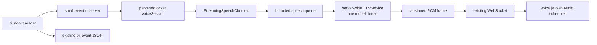
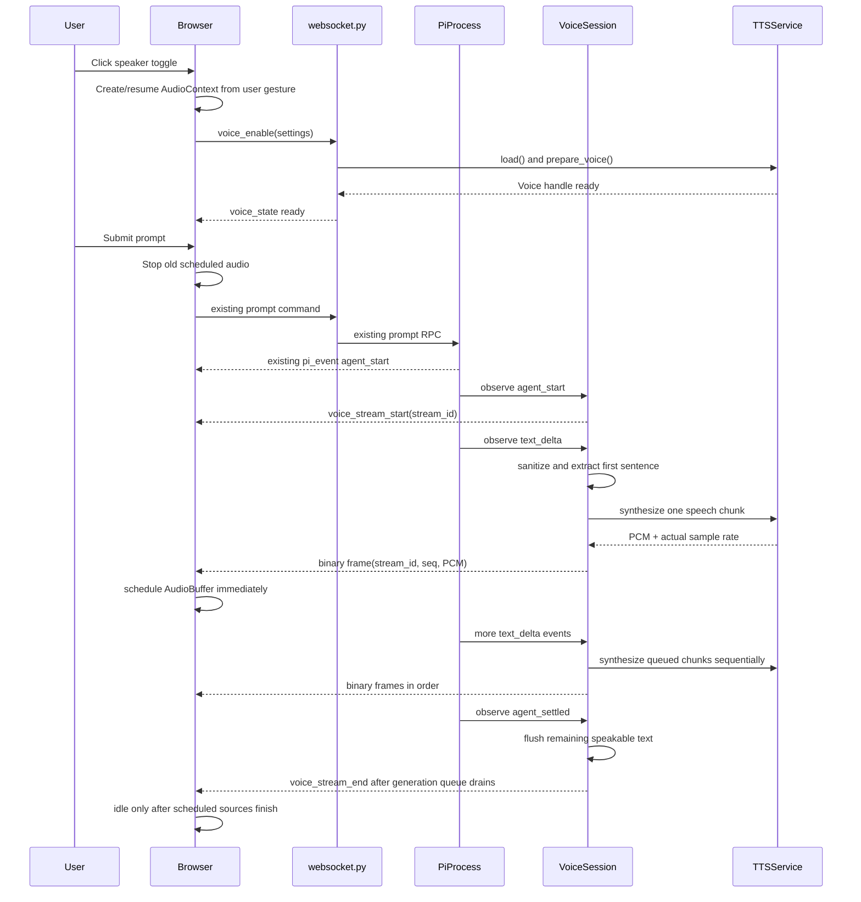

# Voice Mode Implementation Guide for pi-chat

## Purpose, authority, and required inputs

This is the complete feature-specific guide for implementing low-latency,
output-only voice mode in pi-chat. It is intended to be given to one local LLM
together with:

1. Repository-root `AGENTS.md`, which defines the existing architecture,
   runtime invariants, event formats, and baseline verification commands.
2. The loaded orchestration skill at
   `/Users/bbilbro/Documents/pi-subagent/skills/orchestrate-subagent-stack/SKILL.md`.

This guide contains all feature-specific design, protocol, testing, and
execution requirements needed for the implementation.
When instructions conflict, follow this order:

1. Direct user instructions
2. Repository `AGENTS.md` runtime and rendering invariants
3. This guide's voice-feature requirements
4. The orchestration skill's delegation and receipt mechanics

The pinned OmniVoice source contract is upstream commit
`28bc0889d92110491d726a9c79f26a895db5a074` dated 2026-07-30.

The implementation must remain additive and local. Do not replace the current
WebSocket protocol, move pi RPC into another process, add a frontend framework,
or change the existing live/historical rendering contract.

## Goal

Add opt-in text-to-speech output for top-level assistant text using OmniVoice.
Begin synthesis while pi is still streaming the response, play chunks in order
with minimal gaps, and let the user stop speech immediately.

This is output-only voice mode. Microphone capture and speech-to-text are not in
scope.

### User-visible result

1. The user clicks a speaker button.
2. The server lazily loads OmniVoice and prepares the selected voice.
3. The next top-level assistant response is converted into speech as
   `text_delta` events arrive.
4. The first eligible sentence or clause is synthesized without waiting for
   `agent_settled`.
5. The browser schedules PCM chunks for gap-minimized Web Audio playback.
6. Disabling voice, stopping speech, starting a new response, loading a
   session, reconnecting, or logging out cancels the current voice stream.
7. Text chat continues to work if voice dependencies, model loading, or
   synthesis fail.

## Non-goals

- No microphone or browser speech recognition
- No speaking thinking blocks, tool calls, tool results, sub-agent timelines,
  historic messages, or loaded sessions
- No changes to saved pi message content
- No hidden voice instruction prepended to a user prompt
- No separate TTS microservice for the initial local implementation
- No multiple Uvicorn workers; each worker would load a separate GPU model
- No claim that OmniVoice emits waveform samples incrementally during one
  `generate()` call; it currently returns a complete NumPy waveform

## VRAM and verification assumptions

The production pi LLM is expected to leave at least **10 GB of GPU VRAM free**
before voice mode loads OmniVoice. The pinned upstream documentation indicates
that this should be sufficient, but measured peak usage and post-warm headroom
remain release gates.

The local LLM implementing this plan may itself saturate the GPU, but real
OmniVoice can run on CPU in a separate process. Therefore:

- The implementing LLM must not load the real OmniVoice checkpoint onto CUDA
  as part of its normal test loop.
- All default unit, integration, WebSocket, and browser tests use deterministic
  fakes and require no CUDA allocation.
- After the fast fake suite passes, the implementing LLM runs an explicit,
  slow, real CPU validation in a short-lived subprocess with CUDA hidden.
- CPU validation checks the real checkpoint/API, voice preparation, waveform,
  PCM, and pipeline integration. It does not establish CUDA latency, FlashInfer
  compatibility, GPU VRAM use, or production real-time performance.
- Real CUDA validation remains a separate human-gated phase. The implementing
  LLM prepares one noninteractive command, hands control to the user, and stops.
- The user unloads the implementing LLM, runs the real-GPU validation in a
  short-lived process, then reloads the LLM to inspect saved artifacts.
- Validator process exit releases CPU RAM or GPU VRAM deterministically.
- A final production smoke test still runs the actual production pi LLM and
  OmniVoice together, because isolated measurements cannot prove allocator
  fragmentation or combined-runtime behavior.

CPU inference may take many minutes and may consume substantial system RAM.
Before loading, the CPU validator must record available RAM/disk, refuse to
start below a configurable safety threshold, limit Torch CPU threads, and emit
periodic progress/heartbeat artifacts. Run it serially, never concurrently with
other memory-heavy validation.

Do not add automatic self-termination, GPU process killing, or model swapping
to pi-chat. CPU validation and the GPU handoff are development/test workflows,
not product architecture.

## Critical implementation constraints

The implementation must account for all of these constraints.

1. **The Git checkout is not the model checkpoint.**
   `OmniVoice.from_pretrained()` accepts `k2-fsa/OmniVoice` or a downloaded
   Hugging Face snapshot containing model config, weights, and tokenizer files.
   The GitHub source checkout at `experiments/OmniVoice` does not contain those
   weights and must not be used as `OMNIVOICE_MODEL_PATH`.

2. **`websocket.py` does not receive pi output events.**
   It receives browser commands. `PiProcess._read_stdout()` parses and forwards
   `text_delta` events. Voice needs one small observer hook in `PiProcess`; code
   placed only in the command loop will never see streamed pi events.

3. **Raw PCM without metadata cannot be cancelled safely.**
   A late binary frame from an old response is indistinguishable from the
   current response. Every audio frame needs a versioned header containing a
   stream ID and sequence number.

4. **Cancelling `asyncio.to_thread()` does not stop GPU inference.**
   If an async lock is released while the worker thread is still in
   `model.generate()`, a second call can overlap it. All OmniVoice operations
   must use one dedicated `ThreadPoolExecutor(max_workers=1)`.

5. **Text cleanup must preserve streaming parser state.**
   Preprocessing the whole accumulated buffer before checking whether Markdown
   constructs are open can corrupt split fences/links, lose short chunks, and
   delay lowercase or non-English sentences. Emotion tags normally prefix the
   utterance they modify and are not standalone boundaries.

6. **A 50-chunk queue is not useful backpressure.**
   It can represent minutes of stale speech. Silently dropping old chunks makes
   the spoken answer incoherent. Bound pending work tightly, coalesce when safe,
   and cancel voice for the current response if it cannot remain near real time.

7. **Sequential `source.onended` playback can introduce gaps.**
   Schedule decoded buffers against `AudioContext.currentTime` as soon as each
   arrives. Do not wait for an `ended` callback to create the next source.

8. **Suspending AudioContext on interruption is unsafe on mobile.**
   A later WebSocket event is not a user gesture and may be unable to resume
   audio on iOS. Stop scheduled sources and clear state while leaving the
   unlocked context alive.

9. **Voice design on many short independent chunks can drift.**
   OmniVoice itself warns that short 1–2 second clips can be unreliable without
   a reference. Prepare and cache a reusable voice-clone prompt from a short,
   hidden voice-design bootstrap sample.

10. **The RTF and VRAM figures are hardware-dependent.**
    Upstream reports best-case RTF and H100 FlashInfer benchmarks, not a
    guaranteed RTX 4090 result. Benchmark the actual host and record measured
    values; do not encode unverified numbers as tests.

## Pinned OmniVoice API contract

- Package name/import: `omnivoice` / `from omnivoice import OmniVoice`
- Pinned package version: `0.2.1`
- Python: 3.10 or newer; pi-chat already requires 3.12 or newer
- `OmniVoice.from_pretrained(model_id, device_map=..., dtype=...)`
- `model.generate(...)` returns `list[np.ndarray]`
- The normal output sample rate is exposed as `model.sampling_rate` and is
  normally 24,000 Hz
- Voice design uses `instruct="female, young adult, ..."`
- `model.create_voice_clone_prompt((waveform_tensor, sample_rate), ref_text)`
  creates a reusable `VoiceClonePrompt`
- `num_step=16` is the documented faster alternative to the default 32
- `pad_duration` and `fade_duration` are configurable
- The pinned batch-inference CLI selects `device_map="cpu"` when no accelerator
  is available and warns that CPU inference may be slow
- FlashInfer is optional; upstream recommends CUDA graphs for batch-one
  low-latency use
- Voice design is primarily trained on English and Chinese; voice cloning is
  the more stable mode

## Locked architecture



There are only three voice-specific runtime objects:

- One `TTSService` on `application.state`, shared by all connections
- One `VoiceSession` per authenticated browser WebSocket
- One `VoicePlayer` inside `static/voice.js`

The only core event-path change is an optional `PiProcess.event_observer`.
Existing pi JSON events continue to flow unchanged to `static/chat.js`.

## End-to-end lifecycle



## WebSocket contract

Use the repository's existing snake_case command convention.

### Browser commands

```json
{
  "type": "voice_enable",
  "settings": {
    "gender": "female",
    "age": "young adult",
    "pitch": "moderate pitch",
    "accent": "american accent",
    "style": null,
    "speed": 1.0
  }
}
```

```json
{"type": "voice_disable"}
```

```json
{
  "type": "voice_settings",
  "settings": {
    "gender": "female",
    "age": "young adult",
    "pitch": "low pitch",
    "accent": "british accent",
    "style": null,
    "speed": 1.05
  }
}
```

```json
{"type": "voice_stop"}
```

`voice_stop` cancels the current response's server queue but leaves voice mode
enabled for the next response.

### Server JSON messages

```json
{
  "type": "voice_state",
  "state": "loading",
  "available": true
}
```

```json
{
  "type": "voice_state",
  "state": "ready",
  "available": true,
  "settings": {
    "gender": "female",
    "age": "young adult",
    "pitch": "moderate pitch",
    "accent": "american accent",
    "style": null,
    "speed": 1.0
  }
}
```

```json
{
  "type": "voice_stream_start",
  "streamId": 7,
  "encoding": "pcm_s16le",
  "channels": 1
}
```

```json
{
  "type": "voice_stream_end",
  "streamId": 7,
  "reason": "complete"
}
```

Valid end reasons are `complete`, `stopped`, `superseded`, `disabled`,
`backlog`, and `error`.

```json
{
  "type": "voice_error",
  "code": "voice_oom",
  "message": "Voice could not start because there is not enough free GPU memory.",
  "recoverable": true
}
```

Use stable error codes:

- `voice_dependencies_missing`
- `voice_model_load_failed`
- `voice_oom`
- `voice_invalid_settings`
- `voice_generation_failed`
- `voice_backlog`

Do not send raw tracebacks, access tokens, or full local model paths to the
browser.

### Binary PCM frame

Every binary WebSocket message is one complete synthesized speech chunk.

Header layout, little-endian, 24 bytes:

| Offset | Size | Field |
|---:|---:|---|
| 0 | 4 | ASCII magic `PIV1` |
| 4 | 1 | protocol version, currently `1` |
| 5 | 1 | flags, currently `0` |
| 6 | 2 | header length, currently `24` |
| 8 | 4 | unsigned `stream_id` |
| 12 | 4 | unsigned `sequence` |
| 16 | 4 | unsigned `sample_rate` |
| 20 | 4 | unsigned `sample_count` |
| 24 | N | mono signed 16-bit little-endian PCM |

Python:

```python
PCM_HEADER = struct.Struct("<4sBBHIIII")
payload = PCM_HEADER.pack(
    b"PIV1",
    1,
    0,
    PCM_HEADER.size,
    stream_id,
    sequence,
    sample_rate,
    sample_count,
) + pcm_s16le
```

Browser validation:

- Reject the frame if magic, version, or header length is wrong.
- Reject it if `sample_count * 2 !== payload.byteLength`.
- Drop it silently if `stream_id !== activeStreamId`.
- Drop duplicate or out-of-order `sequence` values.
- Use `DataView.getInt16(offset, true)` so little-endian decoding is explicit.

JSON and binary writes must share the same per-connection async send lock. This
preserves ordering and avoids concurrent Starlette/ASGI sends.

## OmniVoice installation and model layout

### Pinned source checkout

The source can be cloned for audit or development:

```bash
mkdir -p experiments
git clone https://github.com/k2-fsa/OmniVoice.git experiments/OmniVoice
git -C experiments/OmniVoice checkout 28bc0889d92110491d726a9c79f26a895db5a074
```

Add `/experiments/OmniVoice/` to `.gitignore` before cloning there. Do not
commit the nested checkout.

### Application dependency

Prefer a pinned optional dependency so normal text-only pi-chat installs do not
require Torch:

```toml
[project.optional-dependencies]
voice = [
  "numpy",
  "torch==2.8.0",
  "torchaudio==2.8.0",
  "omnivoice @ git+https://github.com/k2-fsa/OmniVoice.git@28bc0889d92110491d726a9c79f26a895db5a074",
]
```

Mirror the pinned OmniVoice PyTorch index configuration for the target CUDA
version. The pinned upstream lock targets CUDA 12.8. Confirm the installed
driver supports that runtime before locking; do not assume every deployment
does.

Install with:

```bash
uv sync --extra voice
```

The main app must still import and start after plain `uv sync`. Imports of
`torch` and `omnivoice` therefore happen lazily inside the model executor, not
at module import time.

### Model checkpoint

Default model identifier:

```text
k2-fsa/OmniVoice
```

For offline operation, download the Hugging Face model snapshot ahead of time
and set `PI_CHAT_TTS_MODEL` to that snapshot directory. The directory must
contain the OmniVoice model files, not the GitHub Python source tree.

The first online load may download model and audio-tokenizer artifacts. Model
download time is not part of warm voice latency.

### Optional FlashInfer acceleration

FlashInfer is an opt-in deployment optimization, not a required dependency.
When enabled and importable:

```python
from omnivoice.models.omnivoice_flashinfer import apply_flashinfer

apply_flashinfer(model, enable_cuda_graph=True)
```

Benchmark these modes on the target RTX 4090:

1. Baseline, 16 steps
2. FlashInfer, 16 steps
3. FlashInfer plus CUDA graph, 16 steps
4. Best of the above at 32 steps for a quality comparison

Keep the fastest stable mode whose speech quality is acceptable. If FlashInfer
fails to import or initialize, log the failure and continue with baseline
unless strict acceleration was explicitly requested.

## Configuration

Add parsed, validated settings to `pi_chat/config.py`.

| Environment variable | Default | Meaning |
|---|---|---|
| `PI_CHAT_TTS_MODEL` | `k2-fsa/OmniVoice` | HF model ID or local snapshot |
| `PI_CHAT_TTS_DEVICE` | `cuda:0` | Torch device |
| `PI_CHAT_TTS_DTYPE` | `float16` | Allow `float16`; allow explicit `float32` for CPU compatibility testing |
| `PI_CHAT_TTS_NUM_STEPS` | `16` | Interactive diffusion steps |
| `PI_CHAT_TTS_FLASHINFER` | `0` | Enable optional FlashInfer |
| `PI_CHAT_TTS_CUDA_GRAPH` | `0` | Enable FlashInfer CUDA graph |
| `PI_CHAT_TTS_CPU_THREADS` | `4` | Torch intra-op threads when device is CPU |
| `PI_CHAT_TTS_MAX_QUEUE_CHUNKS` | `12` | Per-connection unsynthesized chunks |
| `PI_CHAT_TTS_MAX_QUEUE_CHARS` | `1800` | Per-connection unsynthesized text |
| `PI_CHAT_TTS_MAX_HOLD_MS` | `450` | Longest hold after enough text exists |

Invalid values fail fast at app startup with a clear configuration error.
Model loading remains lazy.

Reject FlashInfer/CUDA-graph settings when the selected device is CPU. The CPU
validator uses a separate process and overrides device, dtype, steps, and thread
count explicitly without changing production defaults.

Use one Uvicorn worker. Document that `--workers N` creates N independent model
copies and is unsupported for this local GPU mode.

## Backend implementation

### 1. `pi_chat/tts_service.py`

Create a server-wide service with no dependency on FastAPI or WebSocket.

Public data types:

```python
@dataclass(frozen=True)
class VoiceSettings:
    gender: str = "female"
    age: str = "young adult"
    pitch: str = "moderate pitch"
    accent: str = "american accent"
    style: str | None = None
    speed: float = 1.0


@dataclass(frozen=True)
class VoiceHandle:
    key: str
    settings: VoiceSettings


@dataclass(frozen=True)
class SynthesizedAudio:
    sample_rate: int
    pcm_s16le: bytes
    sample_count: int
    generation_seconds: float
```

Public API:

```python
class TTSService:
    async def load(self) -> None: ...
    async def prepare_voice(self, settings: VoiceSettings) -> VoiceHandle: ...
    async def synthesize(
        self,
        text: str,
        voice: VoiceHandle,
    ) -> SynthesizedAudio: ...
    def status(self) -> dict: ...
    async def close(self) -> None: ...
```

Keep the external service API above, but place model-specific calls behind an
internal runtime seam:

```python
class TTSRuntime(Protocol):
    def load(self) -> None: ...
    def prepare_voice(
        self,
        settings: VoiceSettings,
        bootstrap_text: str,
    ) -> object: ...
    def generate(
        self,
        text: str,
        prepared_voice: object,
        settings: VoiceSettings,
    ) -> tuple[object, int]: ...
    def close(self) -> None: ...
```

The production `_OmniVoiceRuntime` owns the real Torch/OmniVoice imports and
model API calls. `TTSService` owns async state, executor serialization, caching,
timing, validation, and PCM conversion. Tests inject `FakeOmniVoiceRuntime`, so
the production orchestration is tested without importing Torch or touching
CUDA.

Requirements:

- Own exactly one `ThreadPoolExecutor(max_workers=1)`.
- Submit model load, voice preparation, and synthesis to that executor.
- Never access the model from the event-loop thread.
- Accept a runtime factory for tests; default to `_OmniVoiceRuntime`.
- `load()` is idempotent. Concurrent calls await the same load future.
- Await shared load/preparation futures through `asyncio.shield()` so cancelling
  one WebSocket's waiter does not cancel server-wide model work.
- Keep the model resident until application shutdown.
- `_OmniVoiceRuntime` imports `torch`, `numpy`, and `omnivoice` inside its
  executor load path. Constructing `TTSService` with a fake runtime must not
  import them.
- Load with the configured model ID/path, device, and dtype.
- Map validated `float16`/`float32` strings to Torch dtypes explicitly.
- When device is CPU, set the configured Torch intra-op thread count before
  model load and skip every CUDA/FlashInfer operation.
- Do not load Whisper ASR; voice design and prepared prompts supply their own
  reference text.
- Read the sample rate from `model.sampling_rate`.
- If configured, apply FlashInfer after model load.
- Run one warm-up/voice-preparation operation before reporting ready.
- Recognize `torch.cuda.OutOfMemoryError` and runtime messages containing
  `out of memory`; clear partial references and return stable `voice_oom`.
- Clip waveform values to `[-1.0, 1.0]` before conversion.
- Convert with `(samples * 32767).astype("<i2", copy=False).tobytes()`.
- Verify output is non-empty, finite, mono, and one-dimensional.
- Log generation time, audio duration, RTF, text character count, and queue
  wait time without logging full assistant text.

#### Stable voice preparation

For each unique backend voice setting combination:

1. Build the validated OmniVoice `instruct` string.
2. Generate a hidden 3–6 second bootstrap phrase with voice design:
   `"Hello. I'm ready to help with what you're working on today."`
3. Call `model.create_voice_clone_prompt(
   (torch.from_numpy(audio), model.sampling_rate),
   ref_text=bootstrap_text
   )`.
4. Cache the resulting `VoiceClonePrompt` by a stable hash of the instruct
   fields. Keep at most eight entries with LRU eviction.
   Deduplicate in-flight preparation for the same key so simultaneous tabs do
   not generate identical bootstrap samples twice.
5. For response chunks, call `model.generate()` with the cached
   `voice_clone_prompt`, matching `instruct`, validated `speed`,
   configured `num_step`, `postprocess_output=True`,
   `pad_duration=0.02`, and `fade_duration=0.02`.

This adds work when a new voice preset is first selected but produces more
consistent short chunks and makes later response startup faster. A settings
change becomes active only after `prepare_voice()` succeeds and only for the
next response.

Do not enable OmniVoice's optional `normalize_text=True` in the first
implementation. It adds WeTextProcessing/Pynini deployment complexity. The
speech sanitizer below handles a small explicit set of coding symbols; add
full text normalization later only after it is benchmarked.

#### Cancellation rule

Cancelling a coroutine waiting for synthesis cannot stop an already-running
diffusion call. The single-thread executor guarantees that a new call cannot
overlap it. `VoiceSession` must compare stream IDs after `synthesize()` returns
and discard stale PCM.

### 2. `pi_chat/tts_chunking.py`

Implement a stateful streaming parser. Keep raw lexical state across
`text_delta` calls and sanitize only text ranges proven complete by the scanner.
Do not repeatedly sanitize the entire accumulated buffer before determining
whether a Markdown fence, inline-code span, link destination, URL, or control
tag is still open; doing so loses delimiter context when a construct is split
across deltas.

Public API:

```python
class StreamingSpeechChunker:
    def feed(self, delta: str, now: float | None = None) -> list[str]: ...
    def flush_text_block(self, now: float | None = None) -> list[str]: ...
    def finish(self) -> list[str]: ...
    def reset(self) -> None: ...
    @property
    def pending_characters(self) -> int: ...
```

The chunker has two stages:

1. A streaming Markdown/code scanner identifies speakable text and safe break
   positions without splitting inside a construct.
2. A chunk selector emits natural, bounded pieces.

#### Scanner behavior

- Omit fenced code blocks using both backtick and tilde fences.
- Fence markers can be split across deltas.
- Speak inline-code contents but omit backticks.
- Convert Markdown links to their label and omit the destination.
- Omit bare `http://`, `https://`, and `www.` URLs.
- Omit image destinations; retain non-empty alt text as `"image: <alt>"`.
- Strip emphasis, heading, quote, list, and table marker characters.
- Strip HTML tags.
- Convert line breaks and table pipes into pause whitespace.
- Preserve supported OmniVoice bracket tags verbatim.
- Treat unsupported bracketed text as ordinary text.
- Normalize whitespace without joining words that arrived in separate deltas.
- Normalize only these explicit symbols:

| Input | Speech text |
|---|---|
| `->`, `→` | `to` |
| `<=`, `≤` | `less than or equal to` |
| `>=`, `≥` | `greater than or equal to` |
| `==` | `equals` |
| `!=`, `≠` | `does not equal` |
| `&&` | `and` |
| `||` | `or` |

Do not speak an entire long code block, URL, base64 payload, or file attachment.

#### Chunk-selection behavior

Use speakable character counts after sanitization:

- Strong boundary: `.`, `!`, `?`, `…`, `。`, `！`, or `？`, followed by
  whitespace, a line break, a closing quote/bracket, or end-of-block.
- Do not split common abbreviations, decimal numbers, version numbers, email
  addresses, or initials.
- Clause boundary: comma, semicolon, colon, em dash, or line break.
- Preferred first chunk: first strong boundary at 24–120 characters.
- Preferred later chunks: strongest boundary near 80–160 characters.
- Hard maximum: 220 characters; split at the last safe whitespace.
- Once at least 72 characters are buffered, emit at the best clause or
  whitespace boundary after `PI_CHAT_TTS_MAX_HOLD_MS` even if there is no full
  sentence. This prevents an unpunctuated response from delaying speech
  indefinitely.
- `flush_text_block()` emits a completed block only if it has at least 24
  speakable characters. Hold shorter phrases across intervening tool calls so
  OmniVoice does not receive unnecessary one-second fragments.
- `finish()` emits all final speakable text, including a short final phrase.
- Never discard a short chunk. Merge it forward or retain it until `finish()`.
- A control tag such as `[laughter]` stays with the following spoken words; it
  is not itself a chunk boundary.

`VoiceSession` must arm a small timer when the chunker has at least 72 pending
characters. The timer calls a `feed("", now=...)`/due-flush path so a paused LLM
does not require another delta to trigger the maximum-hold rule.

### 3. Minimal additions to `pi_chat/process.py`

Add:

```python
self.event_observer: Callable[[dict], Awaitable[None]] | None = None
self._browser_send_lock = asyncio.Lock()
```

Add methods:

```python
async def send_browser_json(self, payload: dict) -> None: ...
async def send_browser_bytes(self, payload: bytes) -> None: ...
```

Both methods:

- Return harmlessly if `self.ws` is `None`.
- Use `_browser_send_lock`.
- Perform the actual `WebSocket.send_json()` or `send_bytes()`.

Update existing backend browser sends to use these helpers, including pi event
forwarding and command responses. Do not hold the lock around TTS generation or
any other slow work.

In `_read_stdout()`:

1. Resolve pending RPC responses exactly as today.
2. Send the unchanged `{"type": "pi_event", "event": event}` to the browser.
3. Await the optional observer.
4. Catch and log observer errors without stopping stdout reading or chat event
   forwarding.

The observer must only update the chunker/queue and create lightweight tasks.
It must never call `model.generate()` inline.

### 4. `pi_chat/voice_session.py`

This is per-WebSocket voice state and orchestration.

Core fields:

```python
enabled: bool
ready: bool
settings: VoiceSettings
voice_handle: VoiceHandle | None
stream_id: int
sequence: int
active_run: bool
suppress_current_run: bool
chunker: StreamingSpeechChunker
queue: asyncio.Queue[str | Sentinel]
queued_characters: int
worker_task: asyncio.Task | None
hold_timer_task: asyncio.Task | None
prepare_task: asyncio.Task | None
activation_id: int
closed: bool
```

Required methods:

```python
async def enable(self, raw_settings: dict) -> None: ...
async def disable(self) -> None: ...
async def update_settings(self, raw_settings: dict) -> None: ...
async def stop_current(self, reason: str = "stopped") -> None: ...
async def observe_pi_event(self, event: dict) -> None: ...
async def close(self) -> None: ...
```

`enable()` and `update_settings()` must not hold up the WebSocket receive loop
while a model downloads, loads, warms, or prepares a voice. They send the
loading state, increment/capture `activation_id`, create `prepare_task`, and
return. The preparation task installs its result only if its captured activation
ID is still current and the session is still enabled. `disable()` and `close()`
invalidate the ID and cancel only the async waiter; the single model executor
may finish already-running work safely in the background.

If a settings change is requested while a known-good handle exists, keep that
handle for an already-active response. The new handle becomes active for the
next `agent_start` only after preparation succeeds. If voice becomes ready in
the middle of a response, it likewise starts with the next `agent_start`
rather than speaking a partial answer.

#### Settings validation

Accept only these OmniVoice values:

- Gender: `male`, `female`
- Age: `child`, `teenager`, `young adult`, `middle-aged`, `elderly`
- Pitch: `very low pitch`, `low pitch`, `moderate pitch`, `high pitch`,
  `very high pitch`
- Accent: `american accent`, `british accent`, `australian accent`,
  `canadian accent`, `indian accent`, `chinese accent`, `korean accent`,
  `japanese accent`, `portuguese accent`, `russian accent`
- Style: `null` or `whisper`
- Speed: floating point from `0.8` through `1.25`

Reject unknown keys and values. Volume is browser-only and is never sent to
OmniVoice.

#### pi event mapping

| pi event | Voice behavior |
|---|---|
| `agent_start` | Cancel old stream as `superseded`; if enabled and ready, allocate next stream ID, reset chunker/queue, start worker, send `voice_stream_start` |
| `message_update.text_start` | Start/continue a top-level text block; do not reset the whole response |
| `message_update.text_delta` | Feed delta, enqueue emitted speech chunks |
| `message_update.text_end` | Call `flush_text_block()`; retain short fragments |
| `response` with failed prompt | End current stream as `error` |
| `agent_settled` | Call `finish()`, enqueue results then sentinel |
| disconnect/new/load/abort/disable/stop | Cancel current stream with the matching reason |

Multiple `agent_start` events before one `agent_settled` are retry cycles. Stop
scheduled old audio by emitting a new `voice_stream_start` with a new ID; never
deliberately replay the superseded stream.

After `voice_stop`, set `suppress_current_run=True` and ignore later deltas from
that run. Reset suppression on the next `agent_start`.

#### Worker behavior

One consumer task exists per active stream:

```text
await queue item
  -> if sentinel: send voice_stream_end(complete), exit
  -> await TTSService.synthesize(text, captured_voice_handle)
  -> if captured stream ID is no longer active: discard PCM, exit
  -> frame with stream ID and sequence
  -> send bytes immediately
  -> increment sequence
```

Capture the prepared `VoiceHandle` at `agent_start`; settings cannot change the
voice halfway through a response.

Reserve one queue slot for the end sentinel: create an asyncio queue sized to
`max_data_chunks + 1`, enforce `max_data_chunks` manually for speech items, and
insert the sentinel with `put_nowait()`. The pi stdout observer must never wait
for queue capacity. Enqueue the sentinel at most once.

#### Backpressure

Before enqueueing, enforce both configured queue limits. The chunk currently in
synthesis does not count against `asyncio.Queue.maxsize` but should be included
in latency logs.

If limits would be exceeded:

1. Coalesce adjacent unsynthesized chunks while preserving order, up to the
   chunker's 220-character hard maximum.
2. If still over either limit, stop voice for only the current response with
   reason `backlog`.
3. Send `voice_error` with code `voice_backlog`.
4. Keep `enabled=True` so the next response can try again.

Never drop the oldest or middle speech chunks and continue.

### 5. `pi_chat/websocket.py`

Change `handle_websocket()` to accept the shared `TTSService`.

At connection start:

1. Set `pi.ws`.
2. Construct one `VoiceSession(tts_service, pi.send_browser_json,
   pi.send_browser_bytes, config)`.
3. Set `pi.event_observer = voice_session.observe_pi_event`.

Add command dispatch for `voice_enable`, `voice_disable`, `voice_settings`, and
`voice_stop`.

Before existing `new_session`, `load_session`, and `abort` actions, call
`voice_session.stop_current()` with an appropriate reason.

In `finally`:

1. Clear `pi.event_observer`.
2. `await voice_session.close()`.
3. Clear `pi.ws`.
4. Kill the pi subprocess as today.

Do not put `text_delta` processing in `_receive_command()` or the browser
command loop.

### 6. `pi_chat/app.py`

- Construct one `TTSService` in `create_app()` and store it on
  `application.state.tts`.
- Pass it into `handle_websocket()`.
- Allow a fake service to be injected by `create_app()` for tests.
- During lifespan shutdown, close WebSockets/processes as today, then
  `await tts.close()`.
- Do not load the model during app startup.
- An extra HTTP status endpoint is not required; `voice_enable` returns the
  authoritative per-connection state.

## Frontend implementation

### 1. `static/socket.js`

Add `onBinary` to `createSocket()` options.

Immediately after creating a WebSocket:

```javascript
socket.binaryType = 'arraybuffer';
```

In `onmessage`:

```javascript
if (typeof event.data !== 'string') {
  onBinary(event.data);
  return;
}
onMessage(JSON.parse(event.data));
```

On close, invoke the existing callback; `app.js` will tell voice playback to
reset. Keep heartbeat and reconnect behavior unchanged.

### 2. `static/voice.js`

Export one factory rather than module-level state:

```javascript
export function createVoiceController({
  sendCommand,
  onError,
  audioContextFactory,
}) {
  return {
    setAccount,
    toggle,
    openSettings,
    handleServerMessage,
    handleBinaryFrame,
    beforePrompt,
    resetConnection,
    destroy,
  };
}
```

`audioContextFactory` defaults to the browser AudioContext and is injectable in
Node tests.

State:

```javascript
enabled
backendState // disabled | loading | ready | error
settings
account
audioContext
masterGain
activeStreamId
lastSequence
scheduledEndTime
activeSources // Set<AudioBufferSourceNode>
backendStreamEnded
```

#### Audio unlock

The actual speaker-toggle click must:

1. Create `AudioContext` if needed.
2. Call `resume()`.
3. Play a one-sample silent buffer if necessary to satisfy iOS.
4. Then send `voice_enable`.

If the context later reports `suspended`, show a visible “Tap to resume audio”
control. Do not assume a WebSocket callback can resume it.

#### Playback scheduling

For each valid binary frame:

1. Decode and validate the 24-byte header.
2. Drop stale or out-of-order frames.
3. Create a mono `AudioBuffer` with the frame's sample count and sample rate.
4. Fill channel data from signed 16-bit little-endian PCM.
5. Connect a new source through one persistent `masterGain`.
6. Set:

```javascript
const startAt = Math.max(
  audioContext.currentTime + 0.025,
  scheduledEndTime,
);
source.start(startAt);
scheduledEndTime = startAt + audioBuffer.duration;
```

7. Add the source to `activeSources`; remove it in `onended`.
8. Show “speaking” from the first scheduled source until both:
   - the backend sent `voice_stream_end`, and
   - `activeSources` is empty and `scheduledEndTime <= currentTime`.

On `voice_stream_start`:

- Stop every old source with `source.stop()` inside `try/catch`.
- Clear the set and scheduling state.
- Set the new stream ID and reset sequence tracking.

On stop/disable/new prompt/reconnect:

- Stop sources and clear state.
- Do not suspend or close the AudioContext.
- Send `voice_stop` when stopping a server-active stream, except after the
  WebSocket has already closed.

Volume changes update the persistent gain node locally and do not require a
server command.

#### Settings persistence

Use `pi_chat_voice_settings_v1_<account>`. To make the account available, change
`setupAuth(onAuthenticated)` so it calls `onAuthenticated(account)`. Pass that
value from `static/app.js` to `voice.setAccount(account)`.

Store only the validated UI fields. Never store auth data.

### 3. `static/app.js`

Compose voice the same way it composes chat and sessions:

- Create the controller with the existing `sendCommand` closure.
- Pass `voice.beforePrompt` into `setupChat()`.
- Route `voice_state`, `voice_stream_start`, `voice_stream_end`, and
  `voice_error` to `voice.handleServerMessage()`.
- Pass binary frames from `createSocket()` to `voice.handleBinaryFrame()`.
- Call `voice.resetConnection()` on socket close.
- Call the appropriate local stop/reset method before new-session and logout
  flows.
- Pass the authenticated account to `voice.setAccount(account)`.

Do not move chat rendering into `voice.js`.

### 4. `static/sessions.js`

Add an optional `onBeforeSessionLoad` callback to `createSessionPanel()`. Call it
immediately before the existing `sendCommand({type: "load_session", ...})`.
Pass the voice controller's stop/reset callback from `static/app.js`. Do not
change session fetching, ownership, overlays, or loaded-message rendering.

### 5. `static/chat.js`

Add one optional callback to `setupChat()`:

```javascript
let onPromptSubmitted = () => {};

export function setupChat(options) {
  sendCommand = options.sendCommand;
  onPromptSubmitted = options.onPromptSubmitted || (() => {});
  // existing listeners
}
```

Call it immediately before sending a valid prompt. Do not alter the prompt text,
user bubble, attachments, message history, or rendering state.

### 6. `static/index.html` and `static/styles.css`

Use a speaker/output icon, not a microphone icon.

Add:

- Toggle button with `aria-pressed`
- Loading/ready/error/speaking visual states
- A stop-speech control visible while speaking
- Settings disclosure/dialog for gender, age, pitch, accent, optional whisper,
  speed, and volume
- An `aria-live="polite"` status element
- A “Tap to resume audio” button for blocked autoplay

Use the existing theme tokens. Put component rules in `static/styles.css`; add
new palette values only to `static/theme.css`. Keep responsive overrides after
base component rules as required by `AGENTS.md`.

The settings panel must:

- Use real labels and form controls
- Close on Escape
- Restore focus to its opener
- Be keyboard operable
- Fit the existing mobile viewport without covering the send button

## File plan

### New files

| File | Purpose |
|---|---|
| `pi_chat/tts_service.py` | Lazy OmniVoice model, voice cache, serialized inference |
| `pi_chat/tts_chunking.py` | Streaming Markdown-aware speech chunker |
| `pi_chat/voice_session.py` | Per-WebSocket voice state, queue, framing, cancellation |
| `static/voice.js` | UI state and Web Audio scheduling |
| `tests/fakes/voice.py` | Deterministic fake runtime/service and synchronization controls |
| `tests/test_voice_fakes.py` | Fake controls, determinism, and no-Torch import guard |
| `tests/test_tts_service.py` | Service tests with fake OmniVoice model |
| `tests/test_tts_chunking.py` | Streaming chunker tests |
| `tests/test_voice_session.py` | Event mapping, queue, protocol, cancellation |
| `tests/test_voice_fake_e2e.py` | No-GPU pi-event-to-binary-frame integration |
| `tests/test_voice_real_cpu.py` | Explicit slow real-checkpoint CPU smoke tests |
| `tests/test_voice_real_gpu.py` | Human-gated CUDA/VRAM/performance smoke tests |
| `tests/voice_playback_test.mjs` | Binary parsing and scheduler tests with fake audio |
| `tools/run_fake_voice_server.py` | Development server with audible fake PCM |
| `tools/run_voice_cpu_validation.py` | Agent-run real CPU validator and artifact writer |
| `tools/benchmark_voice.py` | Opt-in real-model latency/RTF benchmark |
| `tools/run_voice_gpu_validation.py` | Human-run real-model validator and artifact writer |

### Modified files

| File | Change |
|---|---|
| `.gitignore` | Ignore local OmniVoice checkout and `voice-validation/` artifacts |
| `pyproject.toml`, `uv.lock` | Optional pinned voice dependencies and test tools |
| `pi_chat/config.py` | TTS configuration parsing |
| `pi_chat/process.py` | Observer hook and serialized browser sends |
| `pi_chat/websocket.py` | Voice commands and per-connection session lifecycle |
| `pi_chat/app.py` | Shared service construction/injection/shutdown |
| `static/auth.js` | Pass authenticated account to composition callback |
| `static/socket.js` | Route binary frames |
| `static/app.js` | Compose and route voice controller |
| `static/sessions.js` | Stop local speech immediately before session load |
| `static/chat.js` | Prompt-submitted callback only |
| `static/index.html` | Accessible voice controls |
| `static/styles.css` | Voice component and responsive styles |
| `static/theme.css` | Only if an existing token cannot express a needed state |
| `package.json` | Add voice JS test script |
| `README.md`, `AGENTS.md` | Setup, protocol, files, tests, and runtime invariants |

## Serial subagent execution contract

Use the loaded `orchestrate-subagent-stack` skill for implementation. The stack
is serial because all frames share one model and filesystem. Never launch
parallel workers, never reload the skill in descendants, and never leave a
child frame active across the human GPU handoff.

### Main-to-manager assignment

After calling `agent_status`, the main agent should delegate one voice
implementation manager with this contract:

- **Task:** Implement phases 0–7 of this guide, including fake qualification
  and real CPU validation, while preserving every `AGENTS.md` invariant.
  Prepare, but do not run, the human-gated real-GPU validator.
- **Scope:** The files in this guide's new/modified file tables, their focused
  tests, `git diff`, and the pinned OmniVoice API contract in this guide.
- **Non-goals:** Do not load the real checkpoint onto CUDA; do not run
  `voice_gpu` tests; do not redesign pi process/session/rendering architecture;
  do not modify unrelated upload, auth, session, or sub-agent behavior.
- **Acceptance:** Phases 0–7 meet their exit criteria; normal tests import
  neither Torch nor OmniVoice; real CPU artifacts pass; the GPU validator is
  syntax/unit-tested with mocked commands; a read-only integration verifier has
  checked the combined diff, CPU artifacts, and commands.
- **Verification:** Use the exact normal-suite commands under “Existing
  regression checks,” plus the focused commands assigned below.
- **Budgets:** Choose bounded time/turn limits appropriate for a multi-slice
  manager, leaving enough room to reconcile receipts and submit a truthful
  manager result.

The manager retains dependency order, receipts, and unresolved risks. It should
delegate noisy inspection, implementation, and verification rather than
accumulating raw logs in its own context.

### Suggested serial worker queue

These are meaningful implementation slices, not mandatory one-worker-per-file
rules. A manager may combine adjacent slices when the work is small, but must
not merge everything into one broad worker.

| Order | Worker outcome | Primary scope | Prerequisite to validate first | Focused verification |
|---:|---|---|---|---|
| 1 | No-GPU test seams and streaming chunker | `pi_chat/tts_chunking.py`, `tests/fakes/voice.py`, chunker/fake tests | Confirm pi event shapes and optional-dependency requirements in `AGENTS.md`/this guide | `uv run pytest -q -m "not voice_cpu and not voice_gpu" tests/test_voice_fakes.py tests/test_tts_chunking.py` |
| 2 | Serialized TTS service and OmniVoice adapter | `pi_chat/tts_service.py`, `pi_chat/config.py`, dependency metadata, service tests | Import and exercise worker 1's fake runtime before editing | `uv run pytest -q -m "not voice_cpu and not voice_gpu" tests/test_tts_service.py` |
| 3 | Per-connection voice session and transport hook | `pi_chat/voice_session.py`, `pi_chat/process.py`, `pi_chat/websocket.py`, `pi_chat/app.py`, backend tests | Run focused service tests and confirm its public API | `uv run pytest -q -m "not voice_cpu and not voice_gpu" tests/test_voice_session.py tests/test_voice_fake_e2e.py`; Python compile |
| 4 | Browser protocol, playback, and accessible UI | `static/voice.js`, `static/socket.js`, `static/app.js`, `static/chat.js`, `static/sessions.js`, HTML/CSS/theme, JS tests | Confirm binary header and server message contract from worker 3 | Voice JS test; `node --check` for non-vendored JS; `npm test` |
| 5 | Fake full-stack tooling, CPU/GPU validators, and docs | fake server, validator/benchmark tools, `.gitignore`, `README.md`, `AGENTS.md`, artifact/report checks | Run focused backend and frontend suites before consuming their interfaces | Tool `--help`/mocked tests, full normal suite, artifact-schema checks |
| 6 | Independent no-GPU integration verification | All scoped files, tests, artifacts, and `git diff` | Confirm workers 1–5 receipts against the actual filesystem | Full normal-suite commands; diff/scope inspection; no edits |
| 7 | Real CPU checkpoint and pipeline validation | CPU validator, `tests/test_voice_real_cpu.py`, CPU artifacts | Require worker 6's successful fake-verifier receipt and recheck available RAM/disk | Run Phase 7 command; inspect exit code, heartbeats, JSON/log/WAV artifacts |
| 8 | Independent CPU-artifact verification | `voice-validation/cpu/latest/`, adapter/config, `git diff` | Confirm the CPU validator process exited and artifacts are complete | Tie every Phase 7 criterion to persisted evidence; no edits |

Every worker contract must include concrete `task`, `scope`, `nonGoals`,
`acceptance`, `verification`, `timeout`, and `maxTurns` fields. A dependent
worker must begin by checking the prerequisite it consumes rather than trusting
the prior receipt. Each worker reports exact commands, exit codes, changed
files, artifacts, and unresolved issues through `submit_result`.

The integration verifier is read-only. If it fails, the manager launches a new,
narrow recovery worker using the exact failure evidence, then runs a fresh
read-only verifier after any cross-slice repair.

### Closing the stack before the GPU handoff

The phases 0–7 manager may report `completed` when fake and real CPU criteria
pass and the GPU validator command is ready; real-GPU execution is outside that
manager's scope, so it is not an unresolved implementation failure.

The manager submits its final receipt and the main agent returns control to the
user with the single Phase 8 command. No manager or worker remains active while
the implementing LLM is unloaded.

After the user runs the validator and reloads the LLM, start a fresh read-only
worker to inspect `voice-validation/gpu/latest/` and tie each Phase 8 criterion
to artifact evidence. If it fails, use a new targeted recovery worker; do not
repeat the broad implementation assignment. Finish with the manual
Phase 9 production coexistence smoke test.

## Implementation order for one local LLM

Implement in this order and keep every phase green before continuing.

### Phase 0 — No-GPU test seams and fixtures

1. Define the internal `TTSRuntime` protocol.
2. Implement `FakeOmniVoiceRuntime` and `FakeTTSService` in
   `tests/fakes/voice.py`.
3. Add synthetic pi event fixtures covering one sentence, multiple text blocks,
   a tool gap, retry, long unpunctuated text, Markdown, code, and cancellation.
4. Make fake output deterministic and distinguishable by chunk.
5. Prove the fake suite imports without importing Torch or initializing CUDA.

Exit criteria:

- The default test environment needs no voice extra and allocates no GPU memory.
- Fakes can simulate delay, blocked work, OOM, arbitrary exceptions, invalid
  output, alternate sample rates, and configured failure on the Nth call.
- A barrier-controlled fake can prove maximum model-call concurrency.

### Phase 1 — Pure chunking

1. Implement `StreamingSpeechChunker`.
2. Feed synthetic `text_delta` sequences and deliberately split punctuation,
   Markdown delimiters, URLs, and control tags across calls.
3. Add exhaustive unit tests.
4. Do not import OmniVoice.

Exit criteria:

- No text is lost across feed/flush/finish.
- No fenced code or URL content is spoken.
- Short fragments merge rather than disappear.
- First eligible chunks obey the latency and size policy.

### Phase 2 — TTS service

1. Implement the executor-backed service and data classes.
2. Implement `_OmniVoiceRuntime` but exercise it only through mocked imports in
   the normal suite.
3. Inject the fake runtime factory for tests.
4. Implement stable-voice preparation and LRU cache.
5. Implement PCM conversion and timing metrics.
6. Test cancellation while fake generation is blocked; prove that model
   calls never overlap.

Exit criteria:

- Text-only app imports without voice dependencies.
- Concurrent load calls create one model.
- Concurrent syntheses execute one at a time.
- Cancelling one caller never permits overlapping model access.
- PCM format and actual sample rate are correct.
- No exit criterion requires loading the real checkpoint.

### Phase 3 — Voice session and binary protocol

1. Implement settings validation.
2. Implement stream IDs, queue, sentinel, backpressure, framing, and cleanup.
3. Drive it with synthetic pi event sequences.
4. Test retry cycles, multi-block responses, tool gaps, errors, stop, disable,
   reconnect, and slow synthesis.

Exit criteria:

- A `text_delta` can produce a binary frame before `agent_settled`.
- Stale synthesis results are discarded.
- Stream-end is emitted once with the correct ID and reason.
- Queue overflow never produces a spoken answer with missing middle chunks.

### Phase 4 — Minimal pi integration

1. Add locked browser send helpers and observer hook to `PiProcess`.
2. Route all backend sends through the helpers.
3. Create/close `VoiceSession` in `handle_websocket()`.
4. Mount/inject/close `TTSService` in `create_app()`.
5. Run existing Python compile and renderer parity tests.

Exit criteria:

- Existing prompt/session/reconnect behavior remains unchanged with voice off.
- Observer failure cannot stop text event forwarding.
- One connection's voice state cannot leak into another connection.

### Phase 5 — Browser playback and UI

1. Implement/test binary parsing before adding UI.
2. Implement scheduled playback with fake AudioContext tests.
3. Add socket/app composition.
4. Add accessible controls and settings.
5. Verify both themes and mobile layout.

Exit criteria:

- Old stream frames never play after a new stream starts.
- Contiguous received chunks are scheduled without callback-induced gaps.
- Stop is immediate.
- Voice settings persist per profile.
- Existing live/historic assistant DOM parity is unchanged.

### Phase 6 — Full fake qualification

1. Run all Python, JS, renderer-parity, protocol, and fake end-to-end tests.
2. Start `tools/run_fake_voice_server.py`.
3. Replay synthetic pi events through the real process observer,
   `VoiceSession`, WebSocket framing, browser parser, and Web Audio scheduler.
4. Use audible tones with different frequencies per sequence to verify chunk
   order and immediate stop behavior manually.
5. Write the fake qualification result to
   `voice-validation/fake/latest/report.json`.

Exit criteria:

- All normal automated tests pass without Torch import or CUDA initialization.
- The fake end-to-end test produces binary frames before `agent_settled`.
- Cancellation, retries, backlog, stale frames, and reconnect behavior pass.
- The implementation is ready for slow real CPU validation.

### Phase 7 — Agent-run real CPU validation

The implementing LLM creates and syntax/unit-tests
`tools/run_voice_cpu_validation.py`, then runs it in a separate process while
the local LLM remains on GPU:

```bash
CUDA_VISIBLE_DEVICES="" \
uv run --extra voice python tools/run_voice_cpu_validation.py \
  --device cpu \
  --dtype float16 \
  --functional-steps 4 \
  --production-steps 16 \
  --cpu-threads 4 \
  --min-available-ram-gb 24 \
  --min-free-disk-gb 20 \
  --max-runtime-minutes 180 \
  --output voice-validation/cpu/latest
```

The script must set `CUDA_VISIBLE_DEVICES=""` before importing Torch even if the
caller omitted it, pass `device_map="cpu"` through the real adapter, and assert
that CUDA is not selected. FlashInfer and CUDA graphs are disabled.

Implement the validator as a lightweight supervisor plus one model child
process. The supervisor does not import Torch. It writes heartbeats, enforces
the configurable maximum runtime, preserves child stdout/artifacts, and
terminates the child on timeout; child exit releases model RAM.

Before model load, the validator records available RAM, swap, disk, CPU, and
GPU-process state. It refuses to start below `--min-available-ram-gb` or
`--min-free-disk-gb` thresholds. Default to 24 GB available RAM and 20 GB free
disk; allow explicit operator overrides and record the actual thresholds in
`manifest.json`.

The validator must be noninteractive after launch and must:

1. Capture environment, package, CPU, RAM, disk, and GPU-isolation metadata.
2. Load the real checkpoint outside FastAPI.
3. Prepare the default voice.
4. Generate two very short functional chunks at four steps.
5. Generate at least one representative chunk at the production 16 steps.
6. Replay synthetic pi text events through the real `TTSService` and
   `VoiceSession`, without starting a pi LLM.
7. Validate voice-prompt preparation, PCM framing, sample rate, non-empty finite
   output, sequence order, and clean shutdown.
8. Update `progress.json` with stage, elapsed time, and heartbeat timestamp at
   least once per minute so the manager can poll without a long blocking sleep.
9. Record peak process RSS and system available RAM before/after every stage.
10. Record GPU process/memory state before and after and fail if this validator
    allocates GPU VRAM.
11. Write WAV samples, machine-readable JSON, and captured logs even on failure.
12. Exit nonzero when a required check fails.
13. Default `--max-runtime-minutes` to 180 and report timeout as a distinct
    failed check, not as OOM or model incompatibility.

Required artifact layout:

```text
voice-validation/cpu/latest/
├── manifest.json
├── environment.json
├── system-memory.json
├── gpu-isolation.json
├── model-load.json
├── timings.json
├── checks.json
├── progress.json
├── stdout.log
├── prepared-voice.wav
├── production-step.wav
└── chunked-response.wav
```

The CPU-validation worker polls `progress.json` at reasonable intervals,
communicates progress without blocking the parent for more than the host
allows, and reads `checks.json`, `timings.json`, memory measurements, and logs
when the process exits. Do not treat slowness alone as failure.

The pinned CLI uses float16 for CPU fallback. If float16 fails because a CPU
kernel is unsupported, preserve the failure artifacts and rerun with
`--dtype float32` only after confirming there is enough RAM for the larger
weights/activations. Do not silently change dtype inside one result set.

Exit criteria:

- The real package/checkpoint API matches the adapter.
- Voice preparation, real waveform generation, PCM conversion, and a synthetic
  event-to-frame pipeline succeed on CPU.
- At least one representative chunk succeeds at 16 steps.
- CUDA remains hidden and the validator allocates no GPU VRAM.
- Peak system RAM and wall-clock timings are recorded.
- The validator process exits and releases its model RAM cleanly.
- CPU WAVs pass machine checks for duration, finite samples, RMS/non-silence,
  peak range, and gross corruption. Subjective voice consistency remains a
  Phase 8 listening check. CPU timing is recorded but is not compared with
  real-time targets.

### Phase 8 — Human-gated CUDA performance and VRAM validation

After CPU validation passes, the implementing LLM prepares and syntax/unit-tests
`tools/run_voice_gpu_validation.py`, then stops and hands the user:

```bash
uv run --extra voice python tools/run_voice_gpu_validation.py \
  --output voice-validation/gpu/latest
```

The user unloads the implementing LLM, runs the command, waits for the
short-lived process to exit, reloads the LLM, and points it at the artifact
directory.

Because Phase 7 already proves the real API and pipeline, this phase focuses on:

1. CUDA model load and default voice preparation.
2. At least five independent chunks plus one chunked response.
3. Baseline 16-step latency and 32-step quality comparison.
4. Available FlashInfer and CUDA-graph modes.
5. Median/p95 generation time, audio duration, RTF, PCM conversion time, and
   peak allocated/reserved/process-level GPU memory.
6. Clean CUDA shutdown and process exit.

Required artifact layout:

```text
voice-validation/gpu/latest/
├── manifest.json
├── environment.json
├── gpu-memory.json
├── model-load.json
├── benchmark.json
├── checks.json
├── stdout.log
├── direct-design.wav
├── prepared-voice.wav
└── chunked-response.wav
```

Exit criteria:

- CUDA generation and voice preparation succeed.
- The prepared voice is acceptably consistent by listening to the WAV files.
- Both Torch's peak reserved memory and process-level GPU usage are recorded;
  isolated peak process usage is no more than 8.5 GB against the known 10 GB
  production allowance.
- Real CUDA latency/RTF results are recorded rather than assumed.
- The validator process exits and releases its VRAM cleanly.

### Phase 9 — Production coexistence smoke test

Run one manual test with the actual production pi LLM and OmniVoice loaded
together. This is the only phase that proves combined-runtime behavior.

Verify:

1. At least 10 GB is free immediately before voice mode loads.
2. Voice enable, warm-up, and ten representative chunks complete without OOM.
3. At least 1.5 GB remains free after both models are warm and under
   representative load.
4. A normal response, tool-gap response, stop, retry, and reconnect work.
5. Server logs contain measured peak VRAM and latency values.

If combined VRAM does not meet this gate, use a smaller/more quantized pi model,
fewer GPU-offloaded layers, a smaller KV cache/context, or another GPU. Do not
add per-sentence model swapping or broad process orchestration.

Tune only chunk size/hold, generation steps, padding/fade, and optional
FlashInfer flags. Do not change core chat architecture to chase a benchmark.

## Test plan

Add `pytest`, `pytest-asyncio`, and lightweight `numpy` to the development
dependency group if they are not already present. NumPy supports deterministic
fake waveforms and PCM tests; Torch and OmniVoice remain in the optional
production `voice` extra.

### Three-lane verification strategy

#### Lane A — Default fake suite

Every default test uses fakes unless explicitly marked `voice_cpu` or
`voice_gpu`. The normal suite must not import `torch`, call `torch.cuda.*`,
download a checkpoint, or require the `voice` optional extra.

`FakeOmniVoiceRuntime` must provide:

- Configurable `sampling_rate`, defaulting to 24,000
- Deterministic finite waveform output whose duration derives from input length
- A distinct tone/frequency per generation call so ordering is audible and
  machine-verifiable
- Recorded calls and prepared-voice keys
- `active_calls` and `max_active_calls` counters
- Optional sleep/delay
- A `threading.Event` gate that can block a generation call
- Configurable failure on load, prepare, or the Nth generate call
- Simulated OOM, empty output, NaNs, infinities, clipping, and alternate sample
  rates

The executor-cancellation test must:

1. Block fake generation A inside the executor.
2. Cancel the coroutine awaiting A.
3. Request generation B.
4. Assert B does not enter the fake runtime while A is blocked.
5. Release A.
6. Assert `max_active_calls == 1` and B then completes.

`FakeTTSService` is used when testing `VoiceSession`/WebSocket behavior in
isolation. It returns valid `SynthesizedAudio` immediately or under controlled
delay, without retesting model adapter details.

`tools/run_fake_voice_server.py` may be selected only by an explicit
development command and injected through `create_app()`. Do not add a
production environment switch that could silently serve fake speech.

#### Lane B — Explicit slow real-CPU suite

Real CPU tests are marked `voice_cpu`, excluded from the documented/default
fake pytest command, and run through `tools/run_voice_cpu_validation.py`.
The implementing LLM may run this lane because the validator hides CUDA before
Torch import and forces `device_map="cpu"`.

The CPU process must catch failures, flush artifacts in `finally`, close the TTS
service, and exit. It validates real model compatibility and audio correctness,
not interactive latency. System RAM exhaustion is a real risk; preflight and
memory measurements are mandatory.

#### Lane C — Human-gated real-GPU suite

Real-model tests are marked `voice_gpu`, excluded from the documented/default
fake pytest command, and run only through the human-gated validator after the
implementing LLM is unloaded.

The validator runs in one short-lived OS process. It must catch failures, flush
artifacts in `finally`, close the TTS service, and then exit. Even if Python
cleanup fails, process exit releases its CUDA context.

### Chunker tests

- punctuation split across deltas
- Markdown fence marker split across deltas
- long fenced code block omitted without unbounded buffer growth
- inline code spoken without backticks
- Markdown link label spoken and URL omitted
- bare URL split across deltas omitted
- abbreviation (`Dr.`), decimal (`3.14`), version (`v1.2.3`), initials
- English, lowercase next sentence, quotes, and CJK punctuation
- emotion tag remains with following text
- short first sentence merges or flushes without loss
- multiple text blocks separated by a tool call
- hard maximum and maximum-hold timeout
- final short phrase
- empty/Markdown-only/code-only response
- symbol normalization table

### TTS service tests with fakes

- lazy imports and missing-dependency error
- idempotent concurrent load
- load failure and retry behavior
- OOM normalization
- one dedicated executor thread
- non-overlapping syntheses after coroutine cancellation
- voice handle cache hit and LRU eviction
- settings produce valid instruct
- prepared clone prompt reused for chunks
- NaN/out-of-range waveform handling
- little-endian clipped PCM conversion
- sample rate comes from model
- `close()` prevents new work and shuts down cleanly

### Voice session tests

- enable loading/ready/error states
- invalid/unknown settings rejected
- volume rejected as a backend setting
- observer sees `text_delta` through the process hook
- first binary frame emitted before settled
- text block fragments retained across tools
- sentinel drains then emits one complete end
- retry creates a new stream ID
- stop/disable/new/load/abort/disconnect cleanup
- settings update applies to next stream only
- stale generated PCM discarded after cancel
- binary header fields and payload length
- JSON/binary writes serialized
- backlog coalesces, then cancels without silent drops
- two WebSockets share service but not session state

### Browser tests

- valid header decoding
- bad magic/version/length rejection
- stale and out-of-order frame rejection
- PCM conversion
- scheduled start time uses `scheduledEndTime`
- new stream stops old sources
- completed backend stream remains “speaking” until sources drain
- stop keeps AudioContext open/running
- autoplay-blocked state exposes resume control
- volume changes master gain only
- settings use account-specific storage key
- socket routes strings to JSON and ArrayBuffers to binary callback

### Existing regression checks

```bash
npm test
python3 -m compileall -q pi_chat server.py tools
for file in static/*.js; do
  if [ "$(basename "$file")" != "marked.min.js" ]; then
    node --check "$file"
  fi
done
uv run pytest -q -m "not voice_cpu and not voice_gpu"
```

Add the JS voice test to `npm test` or a script that `npm test` invokes so it is
not accidentally skipped. Add a test that asserts `torch` and `omnivoice` are
absent from `sys.modules` after importing the text-only app and fake suite.

### Real CPU tests

Mark slow real-checkpoint CPU tests with `@pytest.mark.voice_cpu` and exclude
them from the default suite. Register the marker in `pyproject.toml`.
`tools/run_voice_cpu_validation.py` is the supported entrypoint and may invoke
those tests internally with the same model/device/dtype configuration used for
its direct checks.

Mocked validator tests must cover preflight refusal, CUDA hiding before Torch
import, progress heartbeats, partial artifact preservation, nonzero failure
exit, supervisor timeout/child termination, float16 failure reporting, and
explicit float32 retry.

### Real GPU tests

Mark real-model tests separately, for example `@pytest.mark.voice_gpu`, and do
not run them in the default unit suite. Register the marker in `pyproject.toml`.
The human-gated validator is the only supported entrypoint for this suite.

`tools/benchmark_voice.py` should accept:

```text
--model
--device
--num-steps
--flashinfer
--cuda-graph
--iterations
--json-output
```

It should report median and p95:

- load/prepare time
- generation time
- audio duration
- RTF
- peak allocated/reserved GPU memory
- PCM conversion time

`tools/run_voice_gpu_validation.py` may call this benchmark internally, but it
must collect the results into the required artifact directory and preserve
partial evidence if a later check fails.

## Performance targets and measurement

These targets apply to the warm CUDA production path. CPU validation has no
real-time target; record its timings only for diagnostics and timeout planning.

| Metric | Required | Stretch |
|---|---:|---:|
| Eligible chunk to first binary byte | under 1.5 s | under 1.0 s |
| Browser receive to scheduled source | under 25 ms | under 10 ms |
| Gap when the next chunk was already received | under 75 ms | under 30 ms |
| Normal unsynthesized queue | at most 3 chunks | at most 1 chunk |
| Production free VRAM before TTS load | at least 10 GB | at least 12 GB |
| Combined free VRAM after warm representative load | at least 1.5 GB | at least 2 GB |

Do not make hardware latency a normal unit-test assertion.

Log monotonic timestamps for:

- first speakable character
- chunk eligible
- service queued
- synthesis start/end
- binary send complete
- stream complete

In browser development logs, record:

- binary received
- buffer decoded
- scheduled start
- source ended

The key user metric is first audible speech from first speakable response text.
Also report the narrower eligible-chunk-to-audio metric so LLM punctuation delay
is visible rather than blamed on TTS.

### Latency tuning order

Tune in this order:

1. Keep model and prepared voice resident.
2. Use 16 diffusion steps if quality is acceptable.
3. Benchmark FlashInfer and CUDA graphs on the actual GPU.
4. Warm the exact synthesis path during voice enable.
5. Emit the first natural sentence early.
6. Use maximum-hold clause splitting for unpunctuated text.
7. Keep chunk padding/fades short and schedule browser buffers ahead.
8. Only then adjust chunk size.

Splitting a completed waveform into smaller WebSocket packets does not reduce
model latency, so do not add 20 ms packetization unless transport measurements
show a real need.

## Error and recovery behavior

| Failure | Behavior |
|---|---|
| Optional dependency missing | Voice toggle reports unavailable; text chat works |
| Model download/load fails | Send stable error; keep app and pi process alive |
| CPU validator RAM/disk preflight fails | Do not load; preserve measurements and report an environment blocker |
| CPU float16 kernel is unsupported | Preserve failure artifacts; explicitly retry float32 only with sufficient RAM |
| GPU OOM on load | Clear partial model, report VRAM guidance, allow explicit retry |
| GPU OOM mid-generation | End current voice stream; keep text response flowing |
| Invalid settings | Keep last known-good settings |
| Slow/backlogged synthesis | End only current speech stream; retry next response |
| Browser rejects autoplay | Show resume button; keep received frames associated with current stream |
| WebSocket reconnects | Stop local sources; new connection begins voice disabled |
| Old GPU job finishes after stop | Discard by stream ID |
| Voice observer raises | Log; continue forwarding all pi events |

Do not automatically retry generation chunks within the same response. A retry
can create repeated or late speech. Let the next response try normally.

## Definition of done

- Voice is opt-in and text-only behavior is unchanged when it is off.
- The app starts without voice dependencies installed.
- OmniVoice source and model checkpoint are not confused.
- The first eligible chunk is synthesized before the full response completes.
- All model operations are serialized even across task cancellation.
- Every binary frame is versioned and tied to a stream ID.
- Old/cancelled audio cannot play in a new response.
- Markdown/code/URL sanitization is streaming-safe and loses no normal prose.
- Short chunks use a prepared stable voice prompt.
- Browser playback is scheduled ahead rather than chained only by `onended`.
- Voice failure cannot terminate the pi process, WebSocket, or text stream.
- Existing renderer parity, Python compile, JS syntax, unit, and fake voice
  tests pass without Torch import or CUDA initialization.
- The real CPU validator passes with CUDA hidden; its checks, timings, RAM,
  GPU-isolation, heartbeat, log, and WAV artifacts are complete.
- Both themes and supported mobile viewports are manually checked.
- The human-gated validator has exited and its JSON/log/WAV artifacts have been
  inspected after reloading the implementing LLM.
- Actual RTX 4090 latency, RTF, isolated peak VRAM, and production coexistence
  results are recorded in the implementation handoff.
- The production pi LLM leaves at least 10 GB before TTS load and the combined
  warm smoke test retains at least 1.5 GB without OOM.
- `README.md` and `AGENTS.md` document setup, configuration, protocol, testing,
  and the new process observer invariant.

## Explicit guardrails for the implementing LLM

- Read `AGENTS.md` before editing.
- Preserve the one-WebSocket/one-`PiProcess` invariant.
- Do not change historical rendering or session storage for voice.
- Do not inject hidden instructions into user messages.
- Do not make Torch/OmniVoice mandatory for normal app startup.
- While the implementing LLM occupies the GPU, load the real checkpoint only
  in the isolated CPU validator with CUDA hidden.
- Do not claim real-GPU validation from fake results.
- Stop and hand the user one noninteractive validation command at the
  human-gated phase; resume only after its artifacts exist.
- Do not call OmniVoice on the asyncio event-loop thread.
- Do not add a second WebSocket or HTTP audio polling path.
- Do not silently drop queued speech and continue.
- Do not hardcode 24 kHz when the model exposes its sample rate.
- Do not use a GitHub source checkout as the model checkpoint.
- Do not claim a latency/VRAM result that was not measured on the target host.
